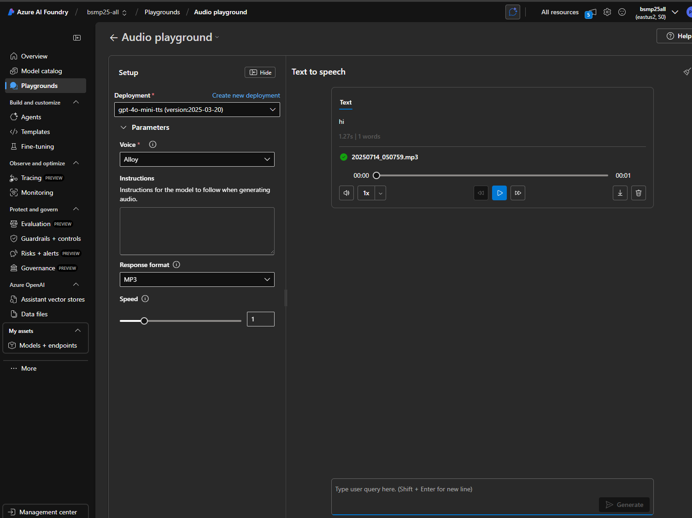
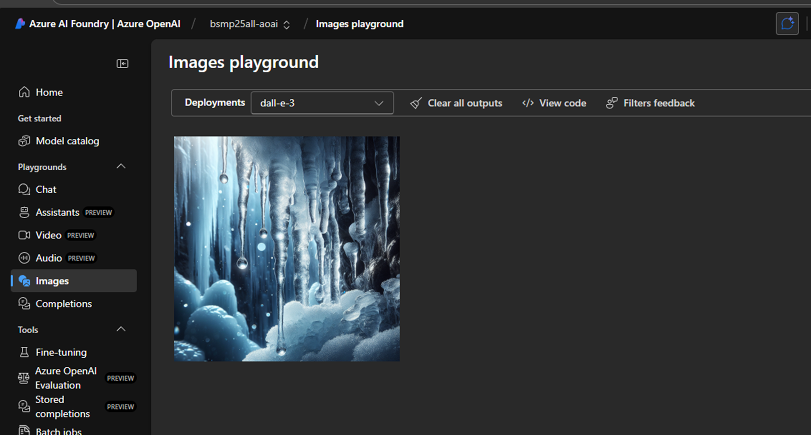
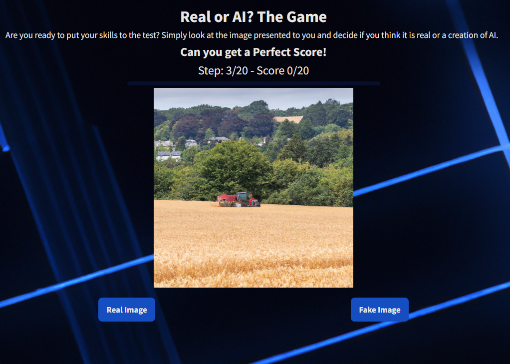

# BSMP 2025 Coding & AI Journey (Advanced Track) 🌐🚀   <!-- {docsify-ignore-all} -->

**Welcome to the BSMP 2025 Advanced Coding & AI Build Academy!**

This course is part of Microsoft’s BAM Summer Mentorship Program and is designed for high school students who are ready to take their coding and creative thinking to the next level.

Over the next few weeks, you’ll Learn the fundamentals of Python, web apps, AI, and GitHub tools; Build your own interactive games and AI-powered experiences with tools like GitHub Copilot, PyGame, and Azure AI; and Create compelling AI-driven stories and multimedia projects using the latest Microsoft technologies.

We’ll explore not just how to code, but how to innovate ethically and responsibly with AI. Get ready to collaborate, experiment, and bring your ideas to life!

Below is a summary of our lesson plans:

1. [Lesson 1 - Introduction to GitHub](/2025/adv/lesson1/lesson1.md)
2. [Lesson 2 - Introduction to Generative AI, Prompt Engineering, and Responsible AI](/2025/adv/lesson2/lesson2.md)
3. [Lesson 3 - GitHub Copilot Web Apps](/2025/adv/lesson3/lesson3.md)
4. [Leson 4 - ​​First Python Game w/ Github Copilot](/2025/adv/lesson4/lesson4.md)
5. [Leson 5 - Basic Chat bot](/2025/adv/lesson5/lesson5.md)
6. [Leson 6 - Building AI Web Apps and Games](/2025/adv/lesson6/lesson6.md) 
8. [Lesson 7 - Copilot Vid Story](/2025/adv/lesson7/lesson7.md) 
9. [Lesson 8 - Realistic Vid Azure Sora](/2025/adv/lesson8/lesson8.md)
10. [Lesson 9 - AI Literacy](/2025/adv/lesson9/lesson9.md)

> [!LESSON_REPO]
>
> Refer to this <i class="fab fa-github"></i> [advanced course 2025](https://github.com/BSMP-Coders/advanced-course-2025) for repo lesson details.

<!-- tabs:start -->  

#### **Lesson 1**

> [Lesson 1 - Introduction to GitHub](/2025/adv/lesson1/lesson1.md)

> example of my github profile page: https://github.com/naivelogic

#### **Lesson 2**

> [Lesson 2 - Introduction to Generative AI, Prompt Engineering, and Responsible AI](/2025/adv/lesson2/lesson2.md)

<!-- tabs:start -->  

#### **LLM Tokens**

#### **AI Model Comparisons**

<!-- tabs:end -->

#### **Lesson 3**

> [Lesson 3 - GitHub Copilot Web Apps](/2025/adv/lesson3/lesson3.md)

<!-- tabs:start -->  

#### **agent mode**

#### **1**

#### **2**

#### **3**

<!-- tabs:end -->

#### **Lesson 4**

> [Leson 4 - ​​First Python Game w/ Github Copilot](/2025/adv/lesson4/lesson4.md)

!> Repo 👉 [Rock Paper Scissors](https://github.com/BSMP-Coders/rock-paper-scissors) 

<video controls style="width:100%; height:auto;">
    <source src="https://nfl24cdn.azureedge.net/nflblob/bsmp25/lesson_media/pygame%20in%20codespaces%20demo.mp4" type="video/mp4">
    Your browser does not support the video tag.
</video>

#### **Lesson 5**

> [Leson 5 - Basic Chat bot](/2025/adv/lesson5/lesson5.md)

> Repo 👉 [flask chat bot](https://github.com/BSMP-Coders/advanced-course-2025/tree/master/lesson6/demos/flask_gpt_basic)

<video controls width="600">
    <source src="https://nfl24cdn.azureedge.net/nflblob/bsmp25/lesson6/flaskchat.mp4" type="video/mp4">
</video>

#### **Lesson 6**

> [Leson 6 - Building AI Web Apps and Games](/2025/adv/lesson6/lesson6.md)

<!-- tabs:start -->  

#### **Autocomplete**

!> Repo 👉 [demos/autocomplete](https://github.com/BSMP-Coders/advanced-course-2025/tree/master/lesson6/demos/autocomplete)

<video controls width="600">
    <source src="https://nfl24cdn.azureedge.net/nflblob/bsmp25/lesson6/autocomplete.mp4" type="video/mp4">
</video>

#### **Chess ai app**

!> Repo 👉 [demos/chess_ai_app](https://github.com/BSMP-Coders/advanced-course-2025/tree/master/lesson6/demos/chess_ai_app)

> 

#### **Flappybird game**

!> Repo 👉 [demos/flappybird](https://github.com/BSMP-Coders/advanced-course-2025/tree/master/lesson6/demos/flappybird)
 
> 

<video controls width="600">
    <source src="https://nfl24cdn.azureedge.net/nflblob/bsmp25/lesson6/flappybird.mp4" type="video/mp4">
</video>

#### **Study Guide App**

> Repo 👉 [demos/studyguideapp](https://github.com/BSMP-Coders/advanced-course-2025/tree/master/lesson6/demos/study_guide_podcast)
> 

<video controls width="600">
    <source src="https://nfl24cdn.azureedge.net/nflblob/bsmp25/lesson6/studyguideapp.mp4" type="video/mp4">
</video>

<!-- tabs:end -->

#### **Lesson 7**

> [Lesson 7 - Copilot Vid Story](/2025/adv/lesson7/lesson7.md)

<!-- tabs:start --> 

#### **Video Generation Example:**

#### **Audio Generation Example:**

#### **Image Generation Example:**

<!-- tabs:end -->

#### **Lesson 8**

> [Lesson 8 - Realistic Vid Azure Sora](/2025/adv/lesson8/lesson8.md)

<!-- tabs:start -->  

#### **Animals Vid**

<video controls style="width:100%; height:auto;">
    <source src="https://nfl24cdn.azureedge.net/nflblob/bsmp25/lesson_media/Animal%20video%20project.mp4" type="video/mp4">
    Your browser does not support the video tag.
</video>

#### **Roblox Vid**

<video controls style="width:100%; height:auto;">
    <source src="https://nfl24cdn.azureedge.net/nflblob/bsmp25/lesson_media/Fix%20Roblox%20WIth%20AI%20Video.mp4" type="video/mp4">
    Your browser does not support the video tag.
</video>

#### **ScholarAI vid**

<video controls style="width:100%; height:auto;">
    <source src="https://nfl24cdn.azureedge.net/nflblob/bsmp25/lesson_media/ScholarAI.mp4" type="video/mp4">
    Your browser does not support the video tag.
</video>

<!-- tabs:end -->

#### **Lesson 9**

> [Lesson 9 - AI Literacy](/2025/adv/lesson9/lesson9.md)

> https://real-or-fake-the-ai-game.onrender.com/

<!-- tabs:end -->