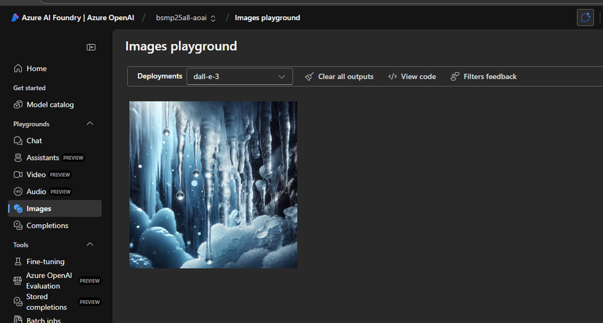

# BSMP Coding Students: How to Login to Azure AI Foundry

## Step-by-Step Instructions

### Step 1: Accept the Invitation
1. Check your BSMP email for an email titled "Microsoft Invitations on behalf of PHale Directory <invites@microsoft.com>."
2. Open the email and click the "Accept invitation" button.
3. If you don't receive this email, please notify me in the meeting.

### Step 2: Confirm Acceptance
1. After clicking the invitation, you should see a confirmation screen.
2. Click "Accept" to continue.

### Step 3: Sign In to Azure AI Foundry
1. Go to [https://ai.azure.com/](https://ai.azure.com/) and click "SIGN IN."
2. Use your BSMP email credentials.

### Step 4: Authenticate and Accept Terms
1. You may be prompted to authenticate with a code sent to your phone or email.
2. Enter the code and verify.
3. Accept the Terms of Service if prompted.

### Step 5: Select the Correct Directory
1. If you see a message about needing an Azure subscription, click on the `plhale30outlook.onmicrosoft.com` directory link.

---

## How to Know You Are in the Right Place

- You should see the Azure AI Foundry dashboard with options for audio and image generation.
- Here are examples of what the correct dashboard looks like:

**Audio Generation Example:**

**Image Generation Example:**

---

If you encounter any issues during these steps, please let me know immediately.