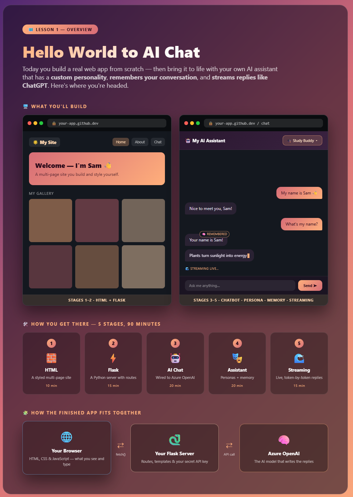
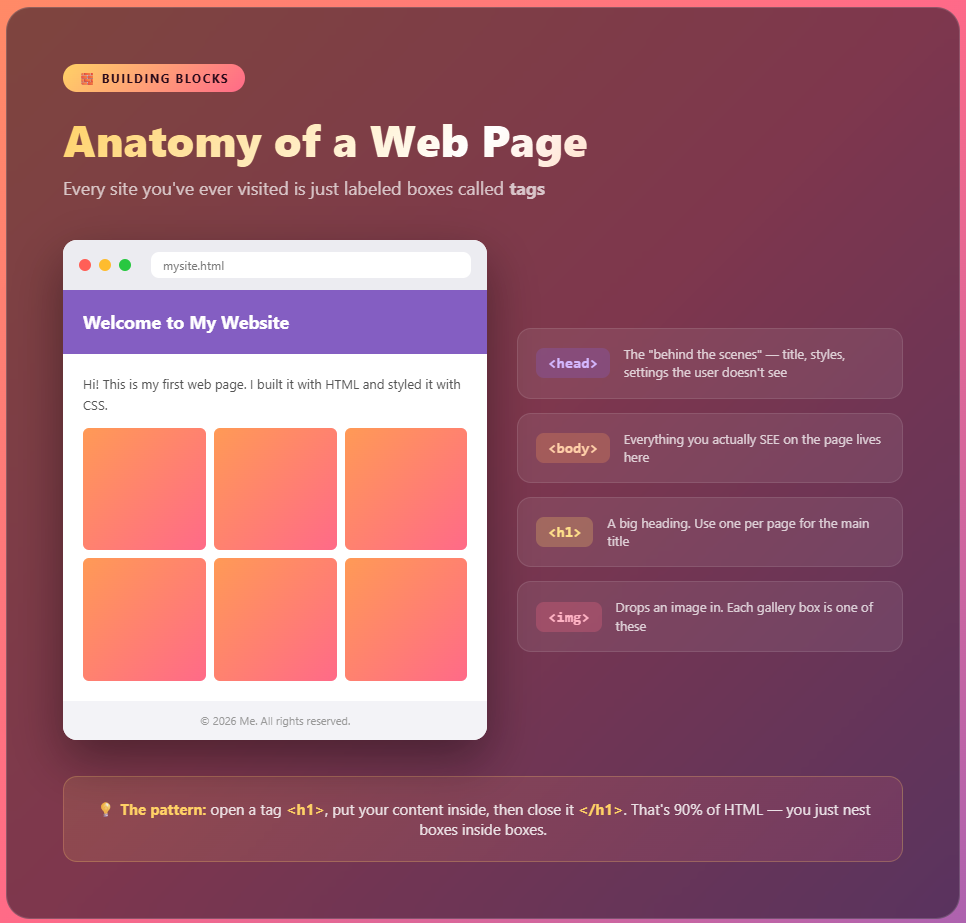
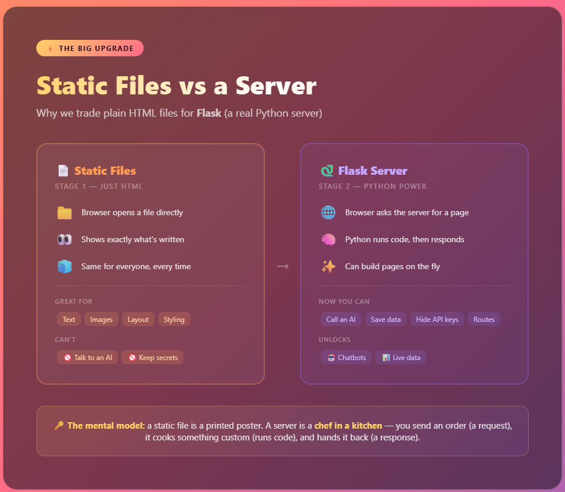
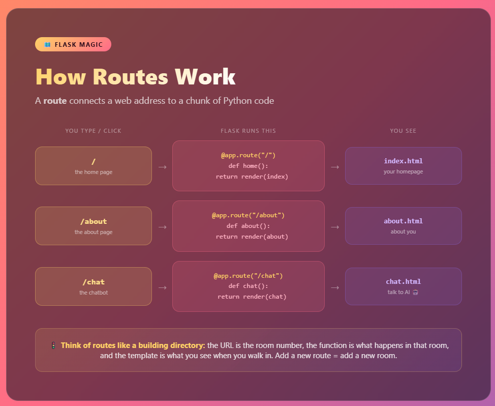
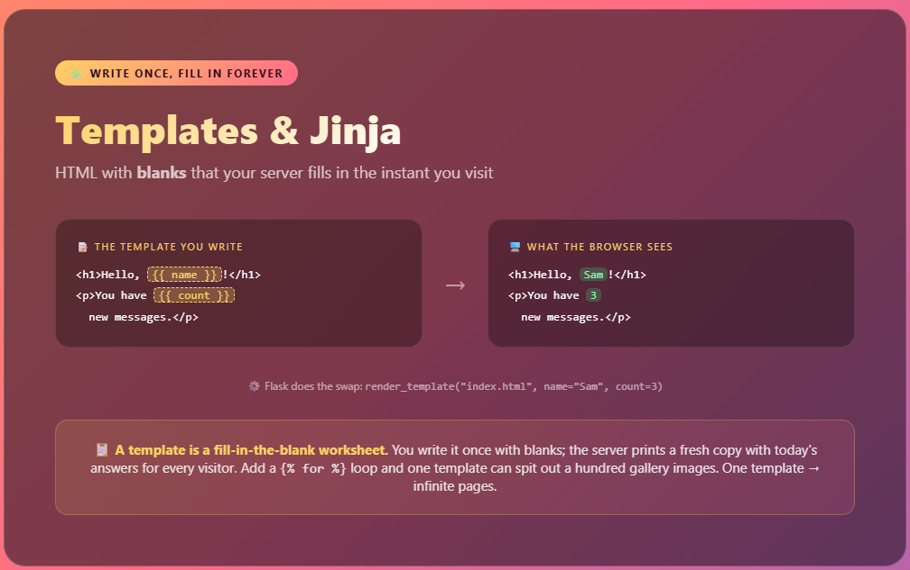
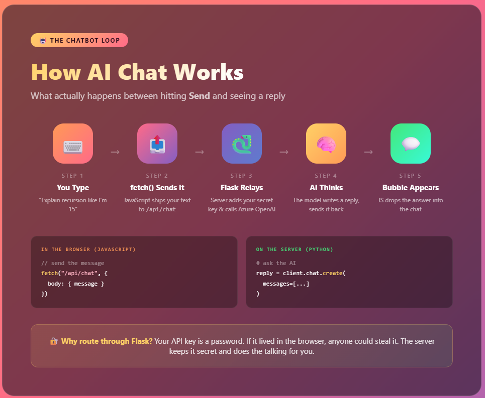
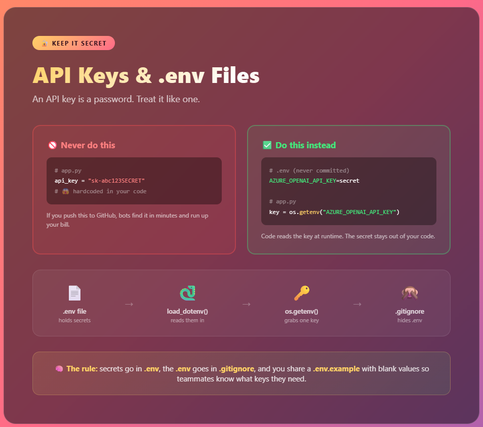
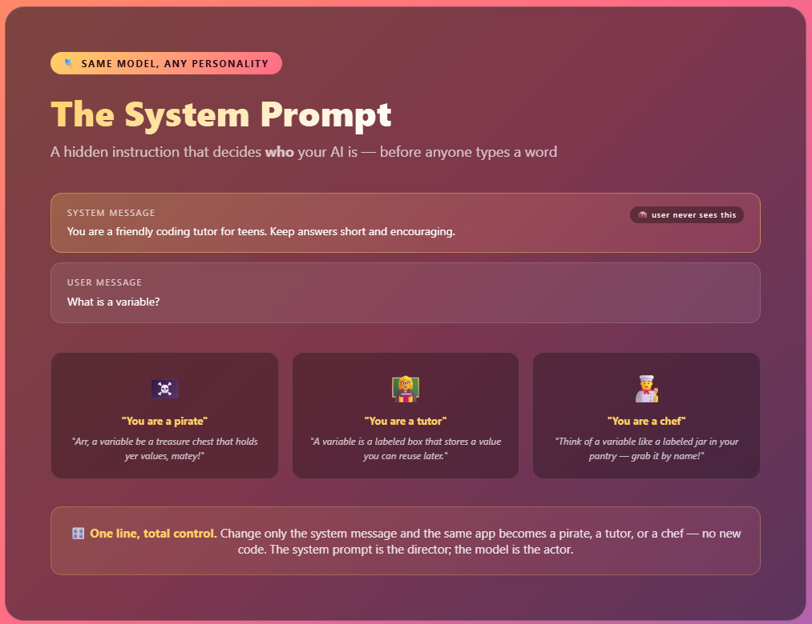
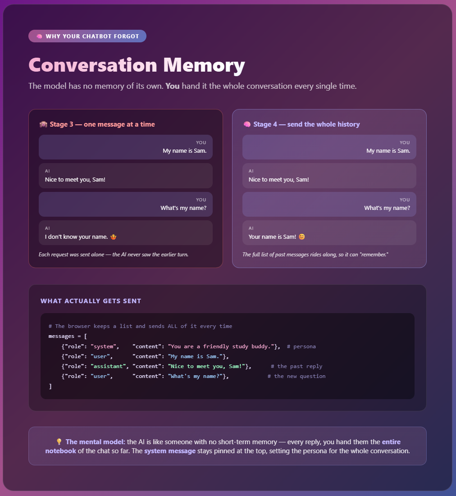
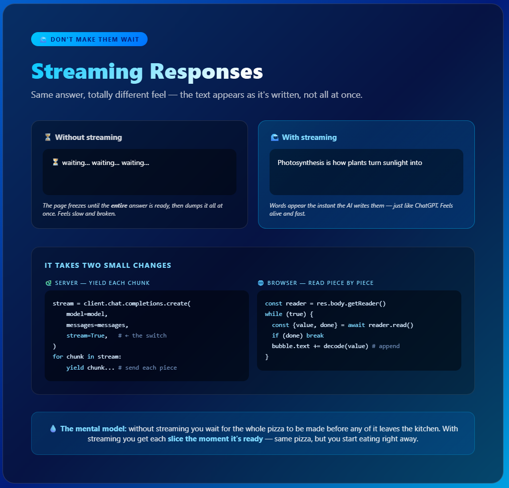

# 🧠 Lesson 1 — Explained

### Supplementary reading for *Hello World to AI Chat*

In this lesson you build a website that grows from plain HTML → a Python server → an AI chatbot → a real **assistant** with a persona, memory, and streaming replies. That's a LOT of new ideas in one sitting. This guide slows it down and explains the *why* behind each piece — no jargon, just the mental models that make it click.

---

## 0. The big build — start here 🚀


<!-- Screenshot of 0_lesson_overview.html goes here -->

Before any code, this is the **whole map** of the lesson. It shows the two things you'll build — your **website** and the **AI assistant** inside it — the five stages that get you there, and how the finished app's pieces fit together: your browser, your Flask server, and the Azure OpenAI model behind it.

Use it to get your bearings: every stage below is one box on this map. When you feel lost, come back here and find where you are.

> 🗺️ **Mental model:** it's the trail map at the start of a hike. You don't need every detail yet — just the shape of where you're going and what "done" looks like.

---

## 1. A web page is just labeled boxes 🧱


<!-- Screenshot of 1_anatomy_of_a_webpage.html goes here -->

Every website you've ever opened — TikTok, your school portal, Wikipedia — is built from the same thing: **HTML tags**. A tag is just a labeled box that says "this is a heading," "this is an image," "this is a paragraph."

The whole game is **nesting boxes inside boxes**:

```html
<body>            <!-- everything you SEE -->
  <h1>My Site</h1>      <!-- a big heading -->
  <p>Hi there!</p>      <!-- a paragraph -->
     <!-- an image -->
</body>
```

You open a tag (`<h1>`), put stuff inside, then close it (`</h1>`). Do that a few hundred times and you've got Instagram. Seriously — it's the same building blocks, just more of them.

**CSS** is the styling layer on top: colors, fonts, spacing, rounded corners. HTML is the skeleton, CSS is the outfit. 💅

---

## 2. Static files vs a real server ⚡


<!-- Screenshot of 2_static_vs_server.html goes here -->

In Stage 1, your page was a **static file** — a printed poster. The browser opens it and shows exactly what's written. Same for everyone, forever. Great for text and images, but it can't *do* anything.

In Stage 2 you upgraded to **Flask**, a Python server. Now there's a brain behind your site. The browser sends a **request** ("hey, give me the home page") and your Python code sends back a **response**. Because code runs in the middle, your site can suddenly:

- 🤖 Talk to an AI
- 💾 Save and load data
- 🔐 Keep secrets safe

> 👨‍🍳 **Mental model:** static file = a poster on a wall. Server = a chef in a kitchen. You place an order (request), the chef cooks something custom (runs code), and hands it back (response).

---

## 3. Routes: your site's room directory 🗺️


<!-- Screenshot of 3_how_routes_work.html goes here -->

A **route** connects a web address to a chunk of Python:

```python
@app.route("/about")     # when someone visits /about ...
def about():             # ... run this function ...
    return render_template("about.html")   # ... and show this page
```

Think of routes like a **building directory**:
- The **URL** (`/about`) is the room number
- The **function** is what happens in that room
- The **template** is what you see when you walk in

Want a new page? Add a new route. That's it. When you added `/chat`, you literally added a new room to your building — one with a chatbot in it.

---

## 4. Templates: HTML with blanks the server fills in 🧩


<!-- Screenshot of 7_templates_and_jinja.html goes here -->

In Stage 2 you stopped writing finished HTML and started writing HTML with **blanks** — pages the server fills in right before sending them to you. That's a **template**, and the blanks are written with double curly braces:

```html
<!-- templates/index.html -->
<h1>Hello, {{ name }}!</h1>
<p>You have {{ count }} new messages.</p>
```

```python
# app.py — Flask fills in the blanks
@app.route("/")
def home():
    return render_template("index.html", name="Sam", count=3)
```

The browser never sees `{{ name }}` — it sees `Hello, Sam!`. Flask swaps in the real value at the last second. This is the **Jinja** templating engine, and it can do more than fill blanks:

```html
      <!-- repeat this block for each item -->
  

```

> 🧩 **Mental model:** a template is a **fill-in-the-blank worksheet**. You write it once with blanks; the server prints a fresh copy with today's answers every time someone visits. One template → infinite pages.

---

## 5. How the AI chatbot actually works 🤖


<!-- Screenshot of 4_how_ai_chat_works.html goes here -->

When you hit **Send**, here's the relay race that happens in under a second:

1. **You type** a message in the browser
2. **`fetch()`** (JavaScript) ships your text to a route called `/api/chat`
3. **Flask** adds your secret key and forwards it to Azure OpenAI
4. **The AI model** reads it, writes a reply, and sends it back
5. **JavaScript** drops the reply into a chat bubble on screen

The key insight: your browser never talks to the AI directly. It talks to *your* server, and your server talks to the AI. Why? Keep reading. 👇

---

## 6. Secrets: never put your password in your code 🔐


<!-- Screenshot of 5_secrets_and_env.html goes here -->

Your **API key** is a password that unlocks the AI — and someone is paying per use. If you hardcode it in `app.py` and push to GitHub, automated bots will find it in *minutes* and rack up charges.

The fix is a `.env` file:

```bash
# .env  (this file NEVER goes to GitHub)
AZURE_OPENAI_API_KEY=your-secret-key-here
```

```python
# app.py  reads the secret at runtime
import os
key = os.getenv("AZURE_OPENAI_API_KEY")
```

**The golden rule:**
- 🔑 Secrets live in `.env`
- 🙈 `.env` is listed in `.gitignore` (so Git ignores it)
- 📋 You share a `.env.example` with *blank* values so teammates know which keys they need

This is the #1 habit that separates "I'm learning to code" from "I code professionally." Do it every single time.

---

## 7. The system prompt: your AI's personality 🎭


<!-- Screenshot of 6_system_prompt.html goes here -->

Why does one chatbot sound like a pirate and another like a patient tutor — using the *exact same* AI model? The secret is the **system prompt**: a hidden instruction your server sends *before* the user's message that sets the AI's role, tone, and rules.

```python
messages = [
    {"role": "system", "content": "You are a friendly coding tutor for teens. Keep answers short."},
    {"role": "user",   "content": "What is a variable?"}
]
```

The user never sees the system message — but it steers *everything* the AI says back. Change that one line and the same app becomes a pirate, a chef, a fitness coach, or a study buddy. No new code, just new instructions.

> 🎛️ **Mental model:** the AI is an actor, and the system prompt is the director whispering "play it grumpy." Same actor, completely different performance.

---

## 8. Conversation memory: why your chatbot forgot 🧠


<!-- Screenshot of 8_conversation_memory.html goes here -->

In Stage 3, every message went to the AI **alone**. Tell it your name, ask "what's my name?" two messages later, and it has no idea — because the model has no memory of its own. Each request was a blank slate.

The fix: send the **whole conversation** every time. The browser keeps a running list of messages, and you ship that entire list on each request:

```python
messages = [
    {"role": "system",    "content": "You are a friendly study buddy."},  # persona, pinned on top
    {"role": "user",      "content": "My name is Sam."},
    {"role": "assistant", "content": "Nice to meet you, Sam!"},            # the past reply
    {"role": "user",      "content": "What's my name?"},                   # the new question
]
```

Now the AI can "remember" — because the history is right there in front of it. The **system message** stays first, setting the persona for the entire chat.

> 🧠 **Mental model:** the AI is someone with no short-term memory. Every reply, you hand them the **entire notebook** of the chat so far. "New Chat" just means starting a fresh notebook.

---

## 9. Streaming: don't make them wait 🌊


<!-- Screenshot of 9_streaming.html goes here -->

Without streaming, the page **freezes** until the full answer is ready, then dumps it all at once — slow and a little broken-feeling. Real assistants like ChatGPT **stream**: words appear the instant the AI writes them. Same answer, completely different feel.

It takes two small changes:

```python
# Server: ask for a stream and yield each chunk as it arrives
stream = client.chat.completions.create(model=model, messages=messages, stream=True)
for chunk in stream:
    yield chunk.choices[0].delta.content
```

```javascript
// Browser: read the response piece by piece and append each one
const reader = response.body.getReader();
while (true) {
  const { value, done } = await reader.read();
  if (done) break;
  bubble.textContent += decoder.decode(value);
}
```

> 💧 **Mental model:** without streaming, you wait for the whole pizza before any of it leaves the kitchen. With streaming, you get each **slice the moment it's ready** — same pizza, but you start eating right away.

---

## 🎯 The big picture

You just learned the full stack of how modern web apps work:

| Layer | What it does | Real-world job that uses this |
|-------|-------------|-------------------------------|
| **HTML/CSS** | Structure & style of the page | Front-end developer |
| **Flask routes + templates** | Server logic & navigation | Back-end developer |
| **fetch + API** | Connecting front to back | Full-stack developer |
| **AI integration** | Adding intelligence (personas, memory, streaming) | AI engineer |

One web app. Four careers' worth of skills. Not bad for one lesson. 🚀

---
