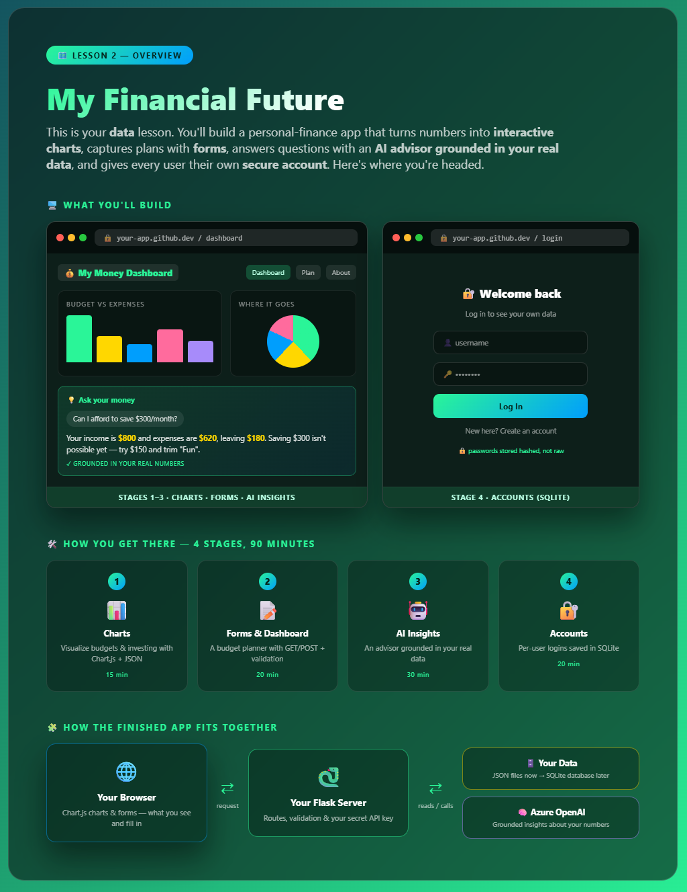
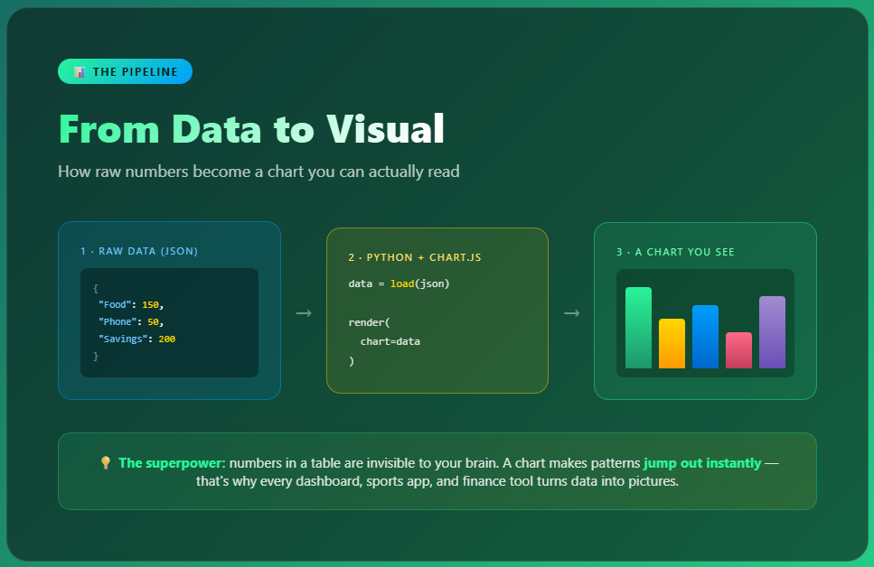
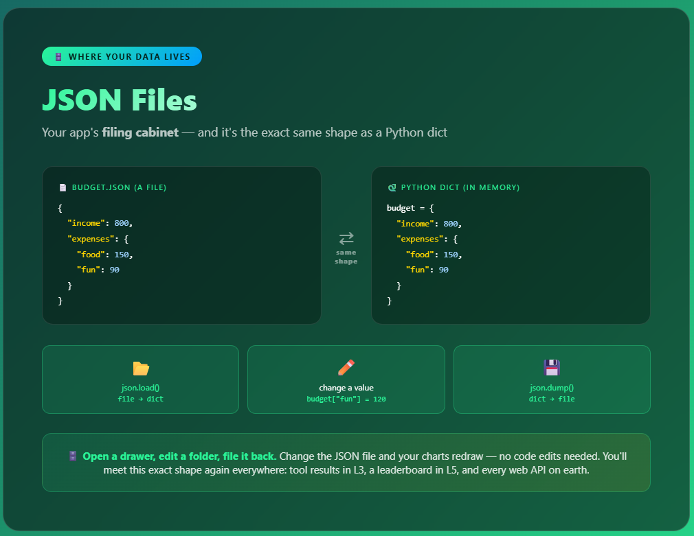
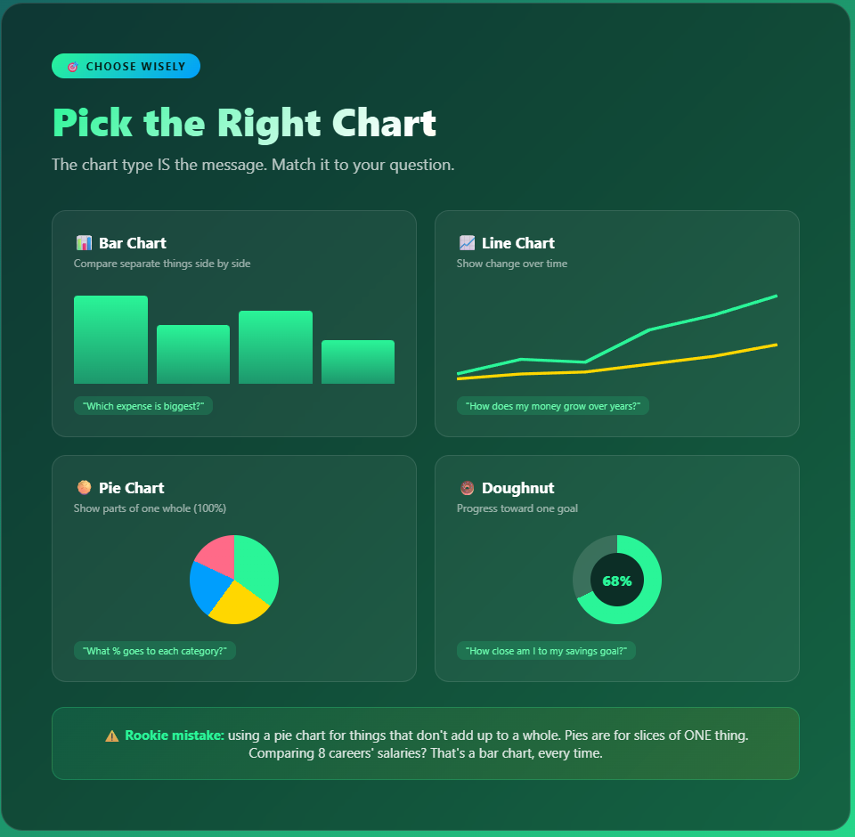
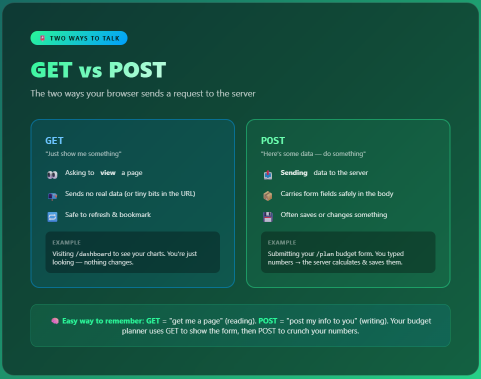
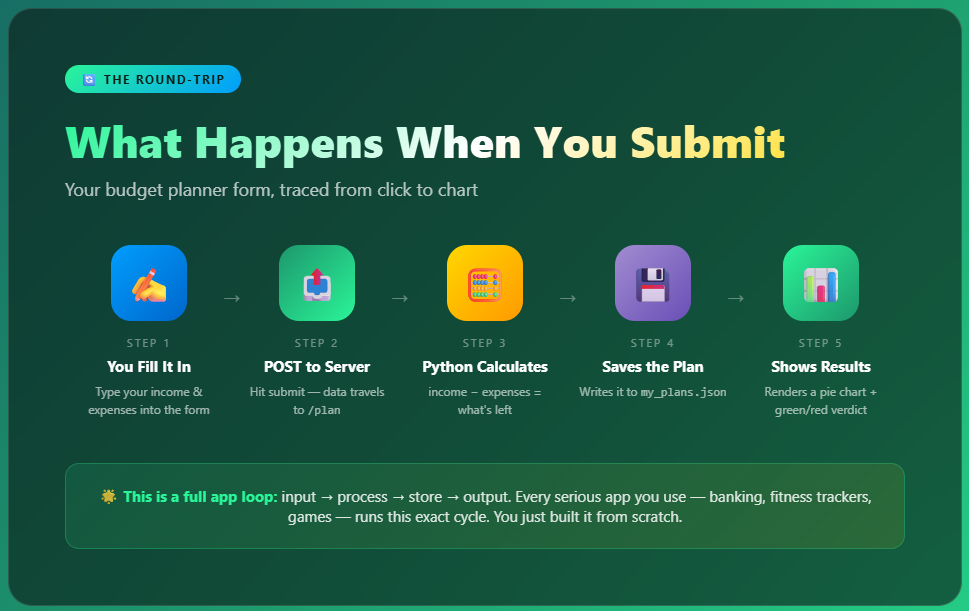
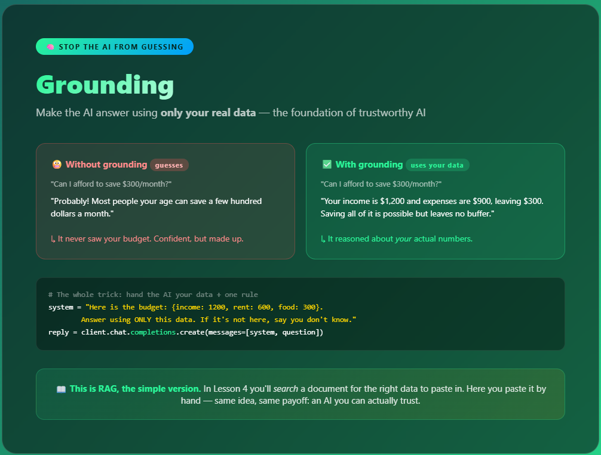
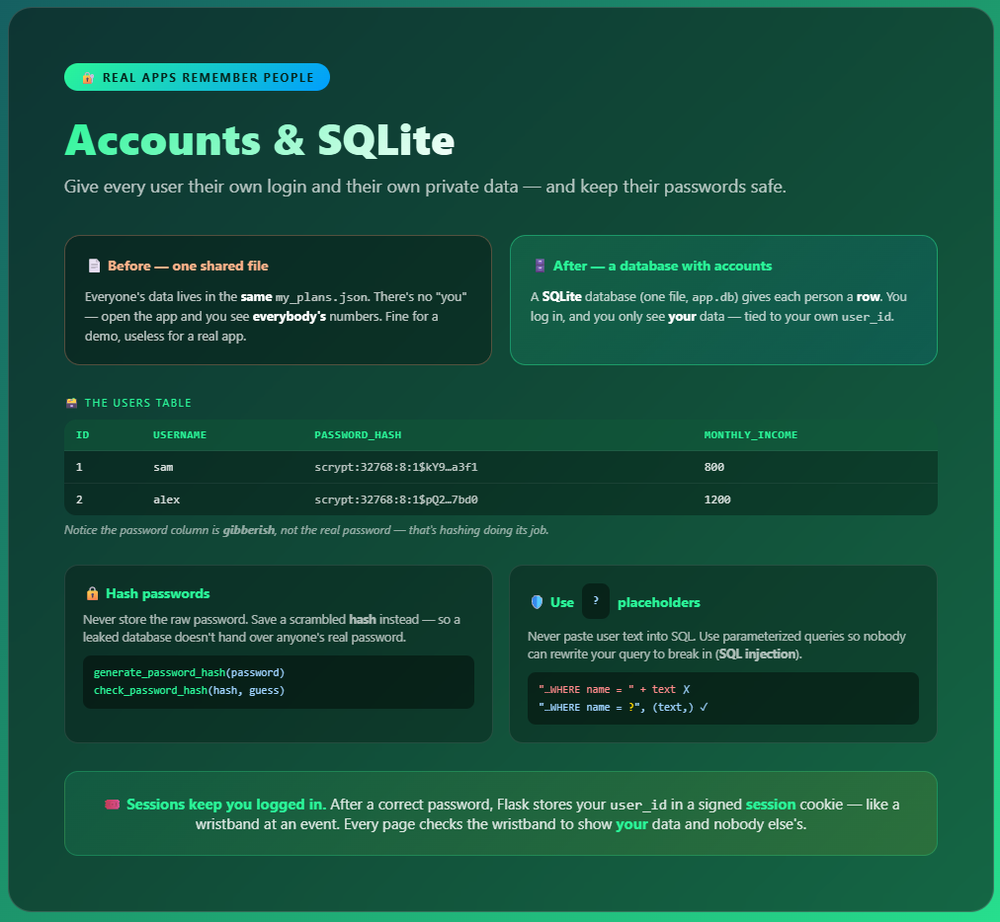
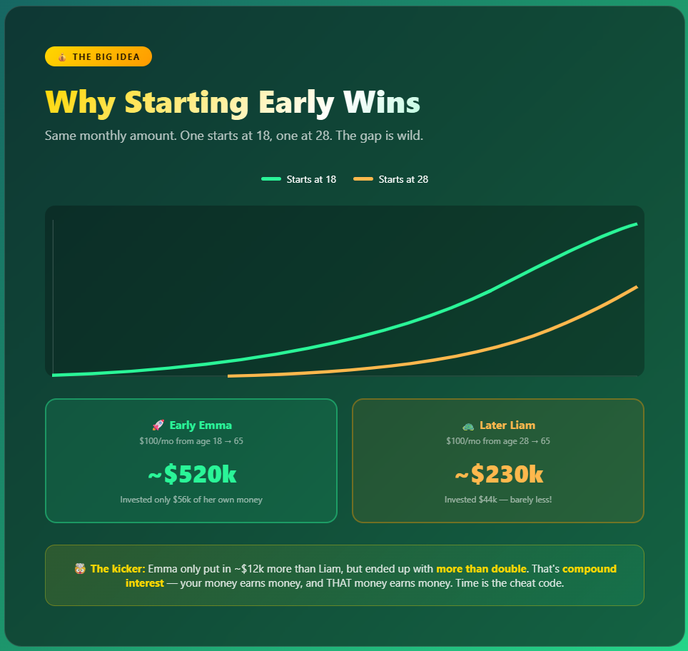

# 💰 Lesson 2 — Explained

### Supplementary reading for *My Financial Future — Data & Visualization*

In this lesson you build a Flask app that turns raw numbers into interactive **charts**, captures plans with **forms**, answers questions with an **AI advisor grounded in your real data**, and gives every user their own **secure account**. This guide explains the concepts behind each piece — the moves behind every dashboard and analytics app — no jargon, just the mental models that make it click.

---

## 0. The big build — start here 🚀


<!-- Screenshot of 0_lesson_overview.html goes here -->

Before any code, this is the **whole map** of the lesson. It shows the app you'll build — a personal-finance dashboard with charts, an AI advisor, and per-user logins — the four stages that get you there, and how the finished app's pieces fit together: your browser, your Flask server, your data store (JSON now, SQLite later), and the Azure OpenAI model behind the insights.

Use it to get your bearings: every stage below is one box on this map. When you feel lost, come back here and find where you are.

> 🗺️ **Mental model:** it's the trail map at the start of a hike. You don't need every detail yet — just the shape of where you're going and what "done" looks like.

---

## 1. Data → Visual: the whole pipeline 📊


<!-- Screenshot of 1_data_to_visual.html goes here -->

A list of numbers is invisible to your brain. Quick — which is bigger, `$1,247` or `$1,274`? Annoying, right? Now imagine them as two bars. Instant. That's the entire point of data visualization.

Your app follows a simple **3-step pipeline**:

```
JSON data  →  Python loads it  →  Chart.js draws it
{ "Food": 150 }     read file      📊 a real chart
```

1. **JSON** — your raw data lives in a tidy file (`budget.json`)
2. **Python** — Flask reads the file and hands the numbers to the page
3. **Chart.js** — a JavaScript library turns those numbers into bars, lines, and pies

You write the data once. The chart redraws itself automatically whenever the data changes. That's why dashboards feel "alive."

---

## 2. JSON: where your app's data lives 🗄️


<!-- Screenshot of 7_json_data.html goes here -->

The pipeline above starts with data in a file. Where does that data *live*? Not buried in your Python code (messy and hard to change), but in a tidy **JSON file**. JSON is just text shaped like labeled boxes:

```json
{
  "income": 800,
  "expenses": { "food": 150, "transport": 60, "fun": 90 }
}
```

If that looks familiar, it should — it's the **same shape as a Python dictionary**. That's the magic: Python reads JSON straight into a `dict`, and writes a `dict` straight back to JSON.

```python
import json

with open("data/budget.json") as f:
    budget = json.load(f)        # file → Python dict

budget["expenses"]["fun"] = 120  # change a value

with open("data/budget.json", "w") as f:
    json.dump(budget, f, indent=2)   # Python dict → file
```

> 🗄️ **Mental model:** JSON is your app's **filing cabinet**. The app opens a drawer (`load`), reads or updates a folder, and files it back (`save`). Edit the JSON file and your charts change — no code edits needed. You'll meet JSON again in every lesson ahead (tool results in L3, a leaderboard in L5, and every web API on earth).

---

## 3. Picking the right chart 🎯


<!-- Screenshot of 2_pick_the_right_chart.html goes here -->

The chart type *is* the message. Choose wrong and you confuse people. Here's the cheat sheet:

| Chart | Use it when you want to... | Example |
|-------|---------------------------|---------|
| 📊 **Bar** | Compare separate things | Which expense is biggest? |
| 📈 **Line** | Show change over time | How does money grow over 40 years? |
| 🥧 **Pie** | Show parts of one whole (100%) | What % of my budget is rent? |
| 🍩 **Doughnut** | Show progress to a goal | How close am I to $3,000? |

> ⚠️ **Classic rookie move:** using a pie chart for things that don't add up to a whole. Comparing 8 different careers' salaries is NOT a pie — those don't sum to 100% of anything. That's a bar chart.

---

## 4. GET vs POST: two ways to talk to the server 📮


<!-- Screenshot of 3_get_vs_post.html goes here -->

Every time your browser talks to the server, it uses one of two "verbs":

- **GET** = *"just show me a page."* You're reading. Visiting `/dashboard` to look at your charts is a GET. Safe to refresh and bookmark.
- **POST** = *"here's some data, do something with it."* You're writing. Submitting your budget form is a POST — you typed numbers and the server calculates + saves them.

**Easy memory trick:**
- **GET** → "**get** me a page" (reading)
- **POST** → "**post** my info to you" (writing)

Your budget planner uses *both*: GET to show the empty form, POST to process your answers.

---

## 5. The form round-trip 🔄


<!-- Screenshot of 5_form_round_trip.html goes here -->

When you submit your budget planner, here's the full journey:

1. ✍️ **You fill it in** — type income and expenses
2. 📤 **POST to server** — the data travels to `/plan`
3. 🧮 **Python calculates** — `income − expenses = what's left`
4. 💾 **Saves the plan** — writes it to `my_plans.json`
5. 📊 **Shows results** — a pie chart + a green ("balanced!") or red ("over budget!") verdict

This is the universal app loop: **input → process → store → output**. Banking apps, fitness trackers, video games — they all run this exact cycle. You just built it yourself.

---

## 6. Grounding: making AI use ONLY your numbers 🧠


<!-- Screenshot of 6_grounding.html goes here -->

Ask a plain AI "is my budget healthy?" and it just *guesses* — it has never seen your numbers. The fix is **grounding**: you paste your real data into the prompt and tell the AI to answer using *only* that.

```
System: "Here is the user's budget: {income: 1200, rent: 600, food: 300}.
         Answer using ONLY this data. If it's not here, say you don't know."
User:   "How much can I save each month?"
```

Now the AI reasons about *your* actual money instead of making things up. That "use only this data" instruction is the whole trick — and it's the exact idea behind **RAG** (Retrieval-Augmented Generation) that you'll build in Lesson 4, just with a hand-written context string instead of a searched one.

> 📖 **Why it matters:** grounding is how you turn a chatbot that *bluffs* into an assistant you can *trust* — the #1 skill for building real AI products.

---

## 7. Accounts & SQLite: real apps remember people 🔐


<!-- Screenshot of 8_accounts_sqlite.html goes here -->

Up to now, everyone's data sat in one shared JSON file — open the app and you'd see *everybody's* numbers. Real apps give each person an **account**. **SQLite** is a tiny database that lives in a single file (`app.db`), and each user gets their own **row**. You log in, and you only ever see *your* data, tied to your own `user_id`.

```python
# Each user is a row in the users table
CREATE TABLE users (
    id INTEGER PRIMARY KEY,
    username TEXT UNIQUE,
    password_hash TEXT,        -- never the real password!
    monthly_income REAL
)
```

Two security habits matter here — and they're the same ones real engineers use every day:

- 🔒 **Hash passwords.** Never store the raw password. Save a scrambled **hash** with `werkzeug.security`, so a leaked database doesn't expose anyone's real password.
- 🛡️ **Use `?` placeholders.** Never paste user text straight into SQL. Parameterized queries (`"...WHERE username = ?"`) stop attackers from rewriting your query to break in — that attack is called **SQL injection**.

> 🎟️ **Mental model:** after a correct password, Flask hands you a **session** — a signed cookie that works like a wristband at an event. Every page checks the wristband to show *your* data and nobody else's. Log out and the wristband is gone.

---

## 8. Bonus — the one money idea worth six figures 💸


<!-- Screenshot of 4_power_of_starting_early.html goes here -->

This one isn't a coding concept — it's the *financial* payoff of the whole lesson, and the reason the data is worth visualizing in the first place. Look at the investment chart you built:

- **Early Emma** invests $100/month starting at **18** → ends with ~**$520,000**
- **Later Liam** invests $100/month starting at **28** → ends with ~**$230,000**

Emma put in only about **$12,000 more** than Liam total... but ended up with **more than double**. 🤯

The reason is **compound interest**: your money earns money, then *that* money earns money too. It snowballs, and the earlier you start, the longer the snowball rolls.

> 💡 **The takeaway:** the most powerful thing in investing isn't being rich — it's being *early*. Time does the heavy lifting. You're 15–18 right now. That's your superpower.

---

## 🎯 The big picture

| Skill | What it really is | Where you'll see it again |
|-------|-------------------|---------------------------|
| **JSON data** | A clean way to store structured info | Every API, every app |
| **Chart.js** | Turning numbers into pictures | Dashboards, analytics, finance apps |
| **Forms & POST** | Letting users send you data | Sign-ups, checkouts, search |
| **Grounding** | Making AI answer from real data, not guesses | Every trustworthy AI product (RAG in L4) |
| **SQLite & accounts** | Per-user data, stored safely | Every app with a login |
| **Compound interest** | Your money working for you | Your actual future 💰 |

You didn't just learn to code charts. You learned to *see* data — turn it into pictures, reason over it with AI, and store it safely per user. That's the core of every analytics and dashboard app on earth. 🚀

---
