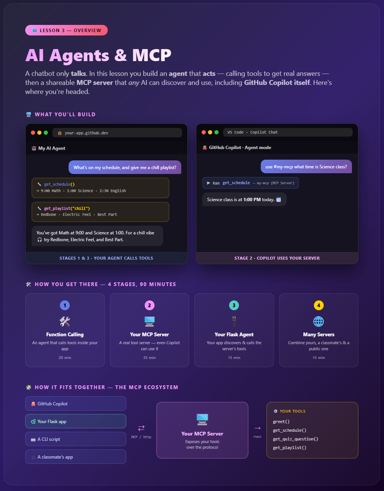
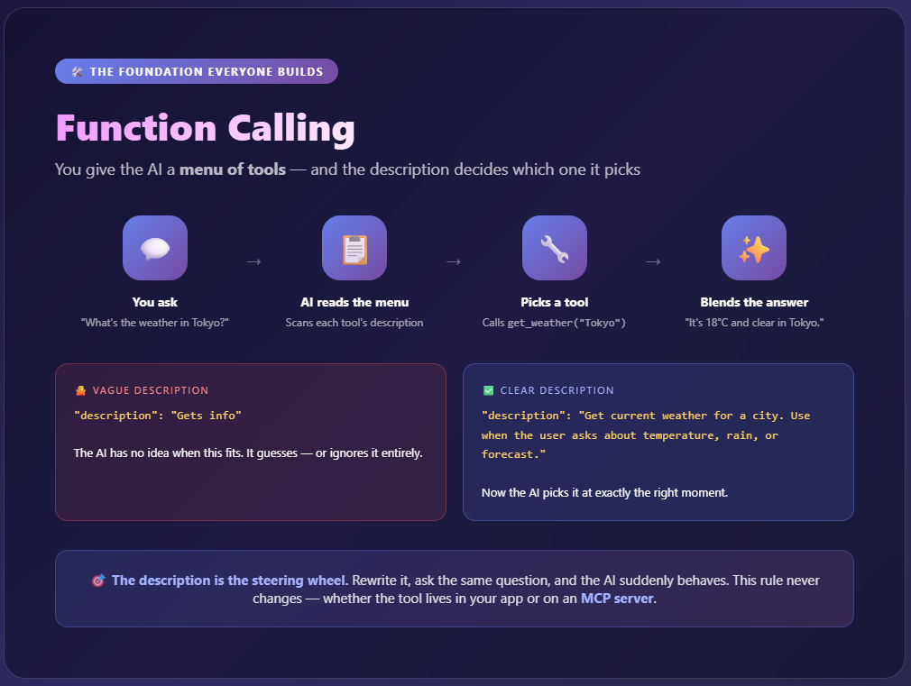
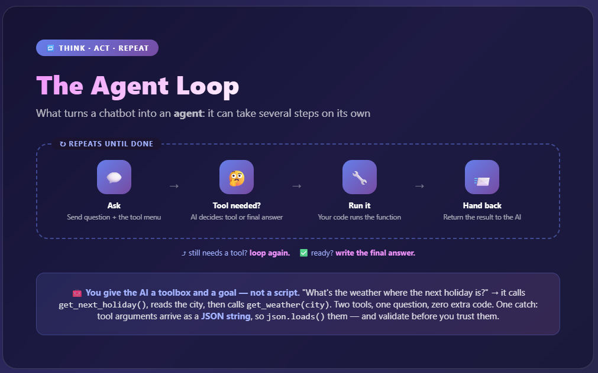
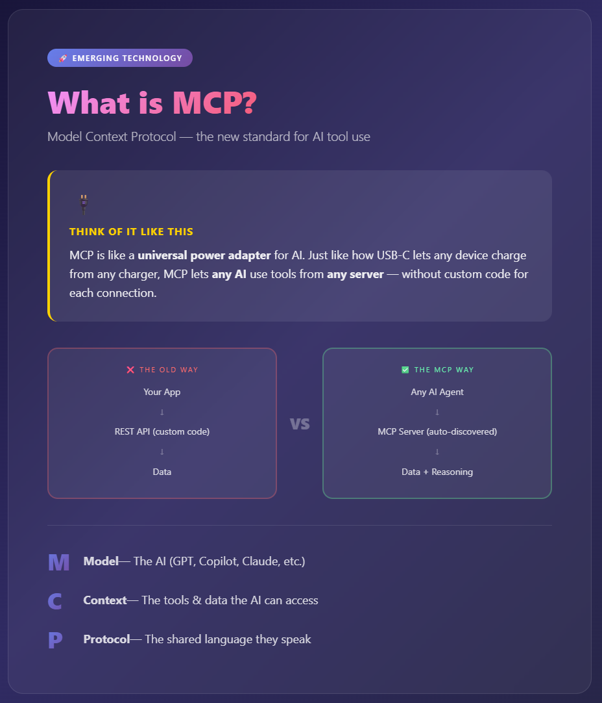
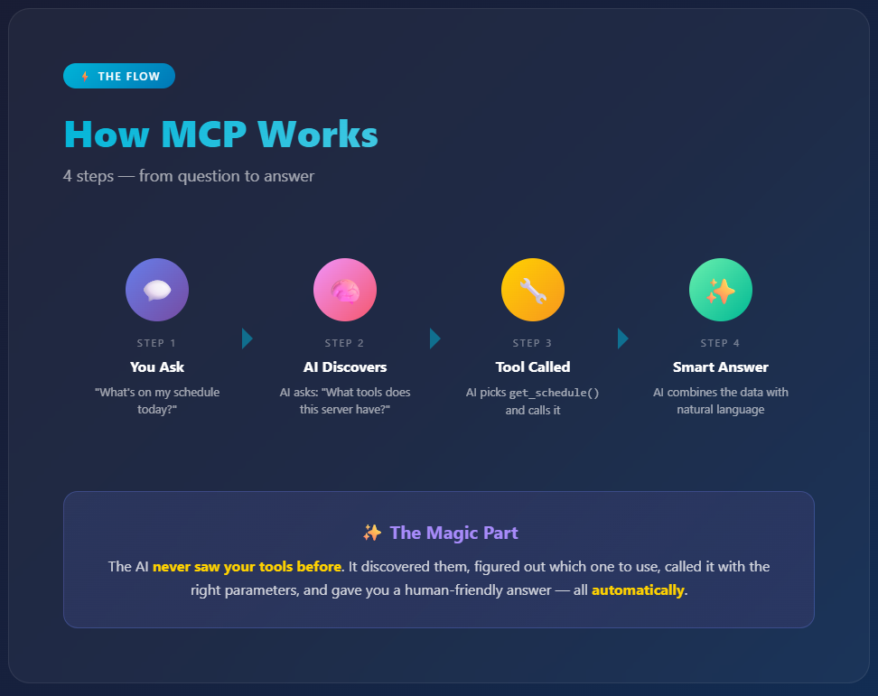
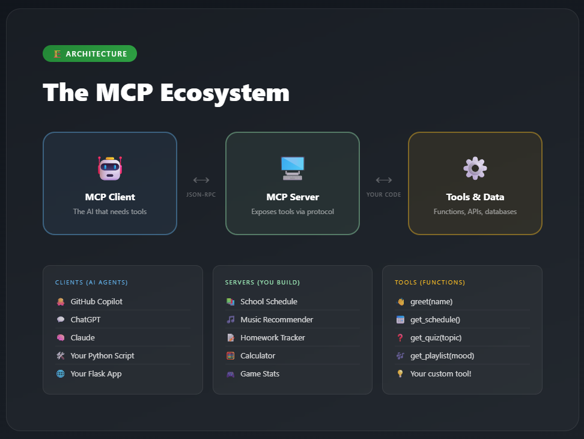
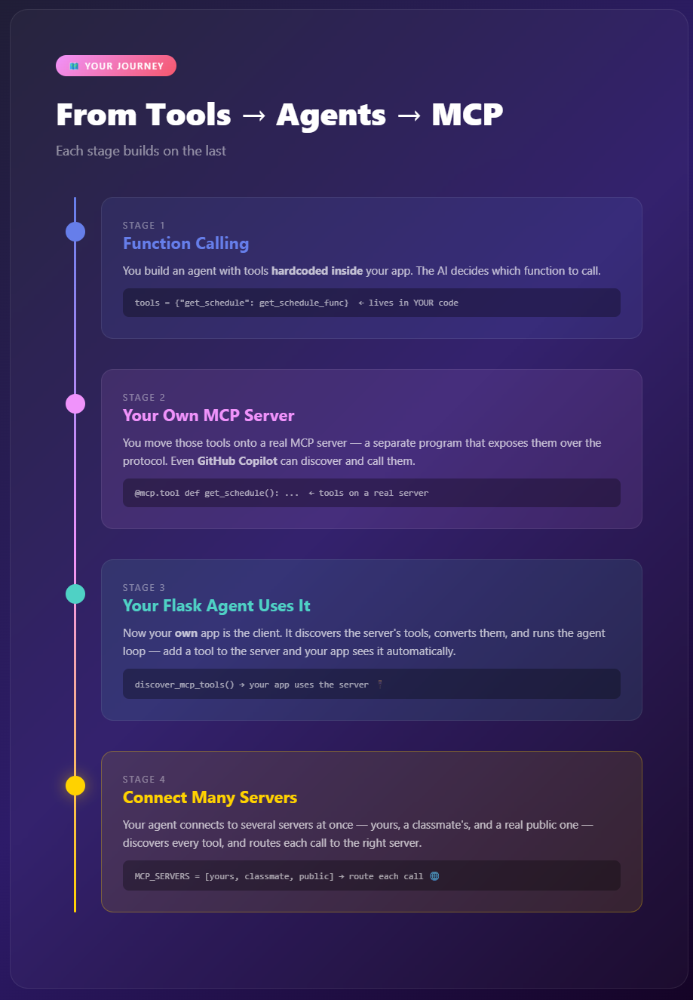
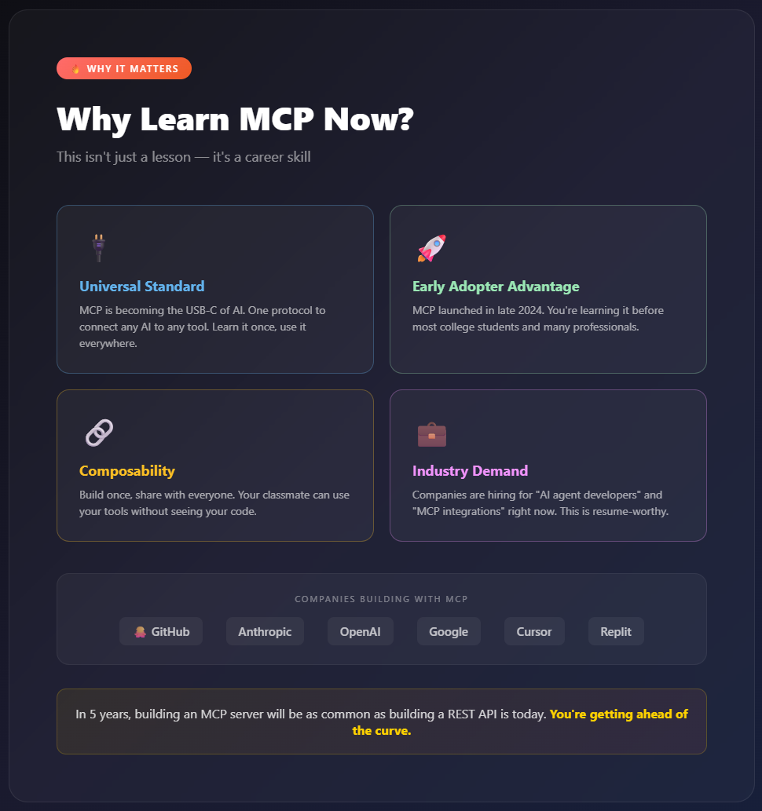

# 🔌 Lesson 3 — Explained

### Supplementary reading for *AI Agents & MCP*

A chatbot can only *talk*. In this lesson you build an AI **agent** that can *act* — call tools to get real answers — then take the leap the whole industry is taking: **MCP (Model Context Protocol)**. You build a real tool **server** that *any* AI can discover and use, including **GitHub Copilot itself**. This guide explains the *why* behind each piece — no jargon, just the mental models that make it click.

---

## 0. The big build — start here 🚀


<!-- Screenshot of 0_lesson_overview.html goes here -->

Before any code, this is the **whole map** of the lesson. You go from a chatbot that only *talks* to an **agent** that *acts*, then to a real **MCP server** that any AI — your own app, a classmate's, even GitHub Copilot — can discover and use. The overview shows the two things you'll build, the four stages that get you there, and how MCP's pieces fit together: many clients, one server, your tools.

Use it to get your bearings: every card below is one piece of this map. When you feel lost, come back here and find where you are.

> 🗺️ **Mental model:** it's the trail map at the start of a hike. You don't need every detail yet — just the shape of where you're going and what "done" looks like.

---

## 1. Function calling: give the AI a menu of tools 🛠️


<!-- Screenshot of 6_function_calling.html goes here -->

Before tools live on a fancy server, they start as plain Python functions inside your app. You hand the AI a **menu** of tools, each with a short **description**, and the AI decides which one (if any) fits the question. (The mechanism is called **function calling** — that's the term in the OpenAI/Azure docs.)

The surprise: **the description is the steering wheel.** The AI picks tools based almost entirely on how you describe them — not the code inside.

```python
# Vague — the AI won't know when to use it
"description": "Gets info"

# Clear — the AI picks it at exactly the right moment
"description": "Look up the current weather for a specific city. Use when the user asks about temperature, rain, or forecast."
```

Rewrite a description, ask the same question, and watch the AI suddenly pick the right tool. *That's* the engineering moment — you're not changing logic, you're changing how the AI understands its options.

> 🎯 **The principle:** a tool is only as good as its description. Whether the tool lives in your app (function calling) or on an MCP server, the clear-description rule never changes.

---

## 2. The agent loop: think → act → repeat 🔁


<!-- Screenshot of 7_agent_loop.html goes here -->

Function calling isn't a single round-trip — it's a **loop**. The AI can call a tool, look at the result, decide it needs *another* tool, and keep going until it's ready to answer. Your code runs that loop:

```
1. Send the question + the tool menu to the AI
2. Did the AI ask for a tool?
     ├─ YES → run the function, hand the result back → go to step 2 again
     └─ NO  → it wrote a final answer → done ✅
```

This is what makes it an *agent* and not just a chatbot: it can take **several steps on its own** to reach a goal. Ask "What's the weather where the next holiday is?" and it might call `get_next_holiday()`, read the city, then call `get_weather(city)` — two tools, one question, zero extra code from you.

> 🔁 **Mental model:** you're not giving the AI a script — you're giving it a **toolbox and a goal**, then letting it pick tools one at a time until the job is done. One subtle but critical detail: the tool's arguments arrive as a **JSON string**, so your code must `json.loads()` them before using them — and that parse is exactly the kind of spot where you validate before trusting (a habit that returns in Lesson 5).

---

## 3. What is MCP? 🔌


<!-- Screenshot of 1_what_is_mcp.html goes here -->

**MCP = Model Context Protocol.** Big name, simple idea: it's a **universal adapter** that lets *any* AI use tools from *any* server.

Think about **USB-C**. Before it, every device needed its own special charger. Now one cable charges your phone, laptop, and headphones. MCP does that for AI:

```
The old way:   Your App → custom REST API → Data   (build it new every time)
The MCP way:   Any AI   → MCP Server → Data         (discovered automatically)
```

- **M**odel — the AI (Copilot, ChatGPT, Claude...)
- **C**ontext — the tools & data it can reach
- **P**rotocol — the shared language they both speak

Build your tools once as an MCP server, and *every* AI can use them. No custom integration per app.

---

## 4. How MCP works ⚡


<!-- Screenshot of 2_how_mcp_works.html goes here -->

The whole flow is 4 steps, from question to answer:

1. 💬 **You ask** — "What's on my schedule today?"
2. 🧠 **AI discovers** — it asks your server "what tools do you have?"
3. 🔧 **Tool called** — it picks `get_schedule()` and runs it
4. ✨ **Smart answer** — it blends the result into a natural reply

> ✨ **The magic part:** the AI had *never seen your tools before*. It discovered them, figured out which one fit, called it with the right inputs, and gave you a human-friendly answer — all automatically. You didn't hardcode any of that.

---

## 5. The MCP ecosystem 🏗️


<!-- Screenshot of 3_mcp_architecture.html goes here -->

MCP has three roles:

| Role | What it is | Examples |
|------|-----------|----------|
| 🤖 **Client** | The AI that needs tools | Copilot, ChatGPT, your Python script |
| 🖥️ **Server** | Exposes tools via the protocol | The one YOU built |
| ⚙️ **Tools** | The actual functions & data | `greet()`, `get_schedule()`, your custom tool |

The beautiful part: because everyone speaks the same protocol, a tool you build works with *any* client. Your classmate's ChatGPT can use the exact same server your Copilot uses. Build once, works everywhere.

---

## 6. Your journey: tools → agents → MCP 🗺️


<!-- Screenshot of 4_stages_journey.html goes here -->

The whole lesson is one climb, and each stage sets the tools a little more free:

- **Stage 1 — Function Calling:** you build an agent with tools *hardcoded inside* your app. The AI chooses which function to call.
- **Stage 2 — Your own MCP Server:** you move those tools onto a real **MCP server** — a separate program that exposes them over the protocol. Even **GitHub Copilot** can discover and call them.
- **Stage 3 — Your Flask agent uses the server:** now your *own* app is the client. It discovers the server's tools, converts them, and runs the agent loop against them — add a tool to the server and your app sees it automatically.
- **Stage 4 — Connect many servers:** your agent connects to several servers at once — yours, a classmate's, and a real public one — discovers every tool, and routes each call to the right server.

By the end the tools are fully independent — exactly how professional AI systems are built.

---

## 7. Why MCP matters 🚀


<!-- Screenshot of 5_why_mcp_matters.html goes here -->

This isn't just a lesson — it's a **career skill**:

- 🔌 **Universal standard** — learn it once, use it with every AI
- 🚀 **Early-adopter edge** — MCP launched in late 2024; you're learning it before most college students
- 🔗 **Composable** — build a tool once, share it with the whole class instantly
- 💼 **In demand** — companies are hiring "AI agent" and "MCP integration" developers *right now*

> 🔮 **The prediction:** in a few years, building an MCP server will be as normal as building a website is today. You're getting in early.

---

## 🎯 The big picture

```
Stage 1: agent with hardcoded tools     (function calling)
Stage 2: your own MCP server            (even Copilot can use it)
Stage 3: your Flask app is the client   (discover + call the server)
Stage 4: connect many servers           (route across yours + others)
```

Instead of building REST APIs and writing docs, you build MCP servers and let the AI figure out the rest. Welcome to the future of how software talks to AI. 🌐

---
