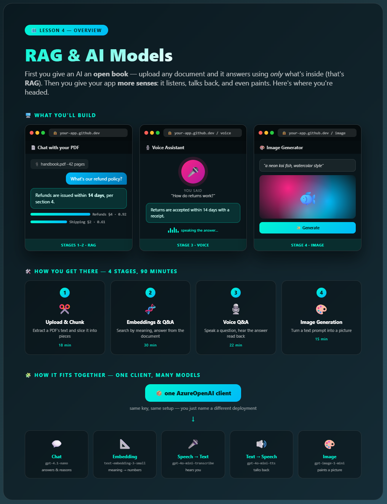
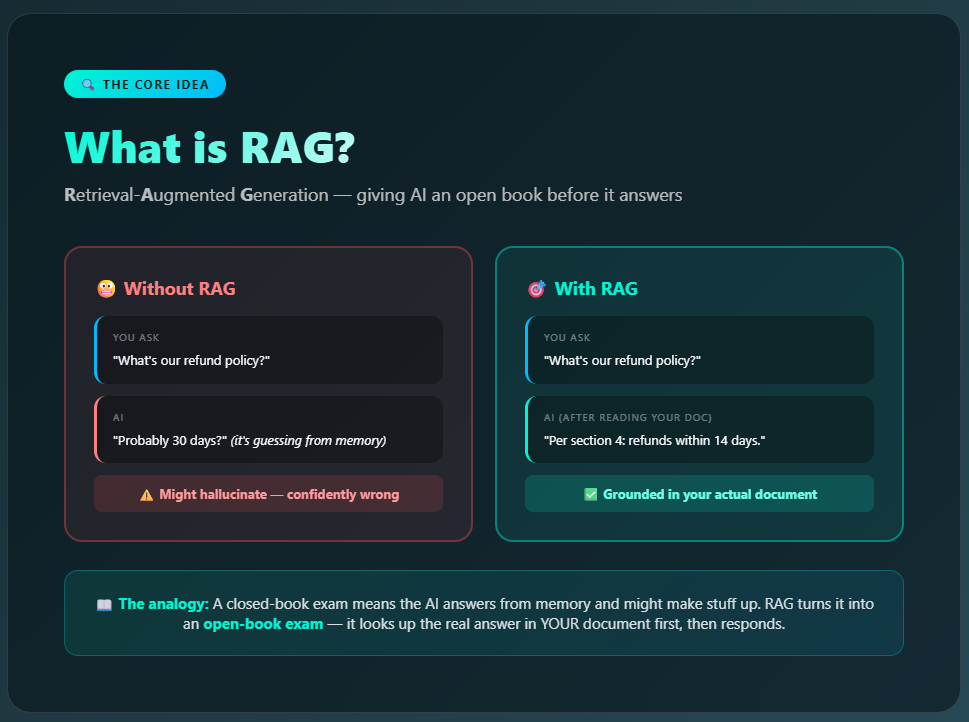
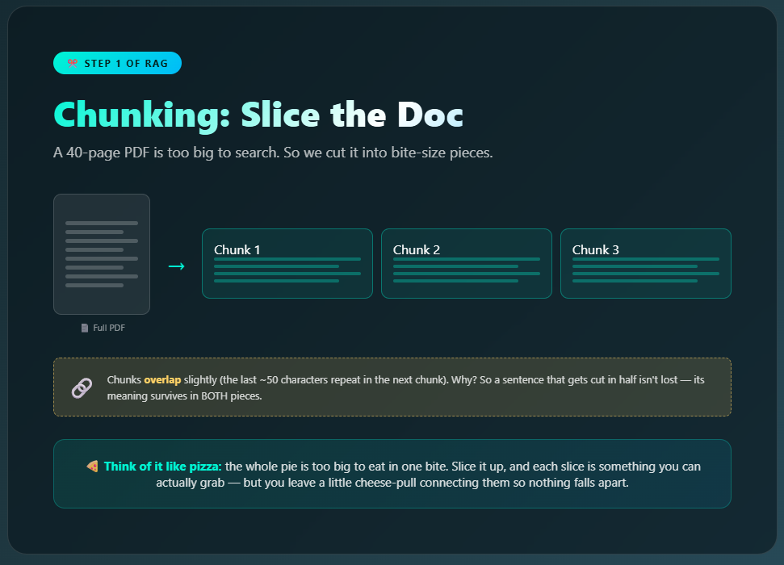
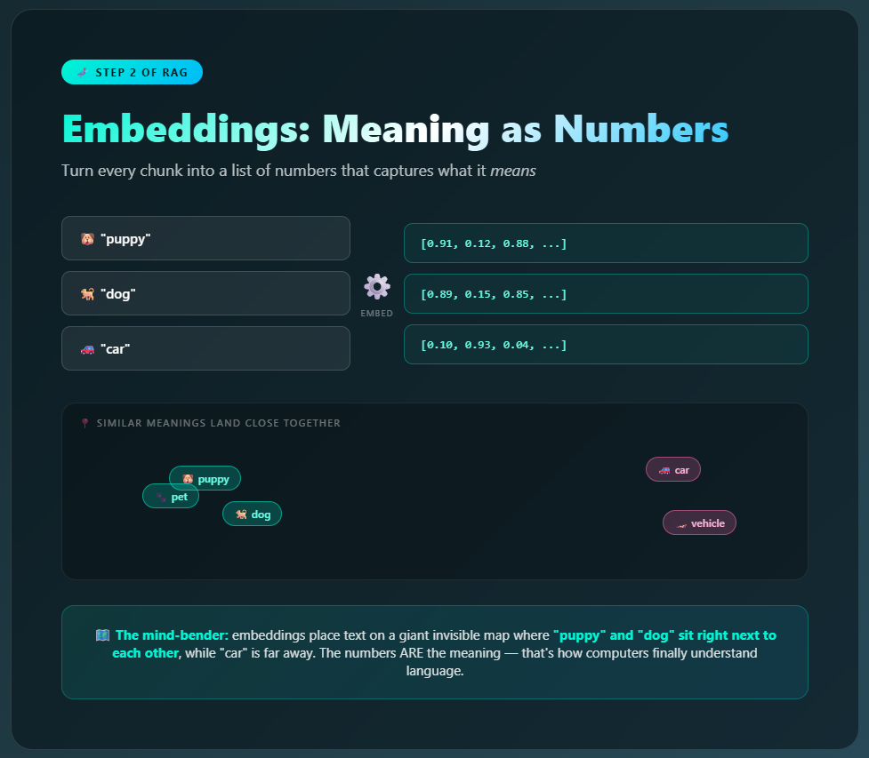
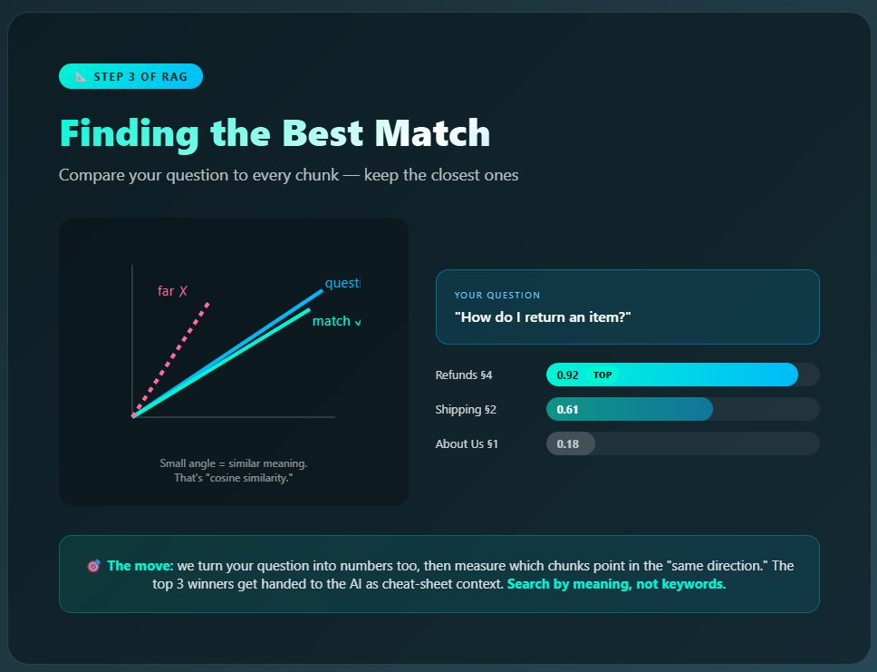
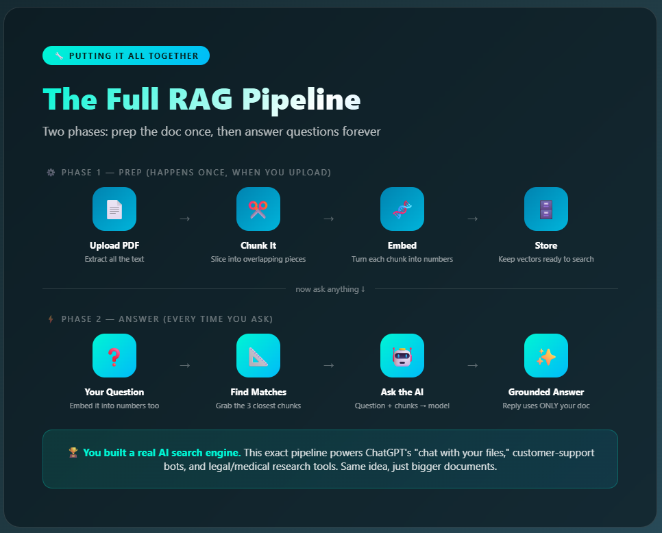
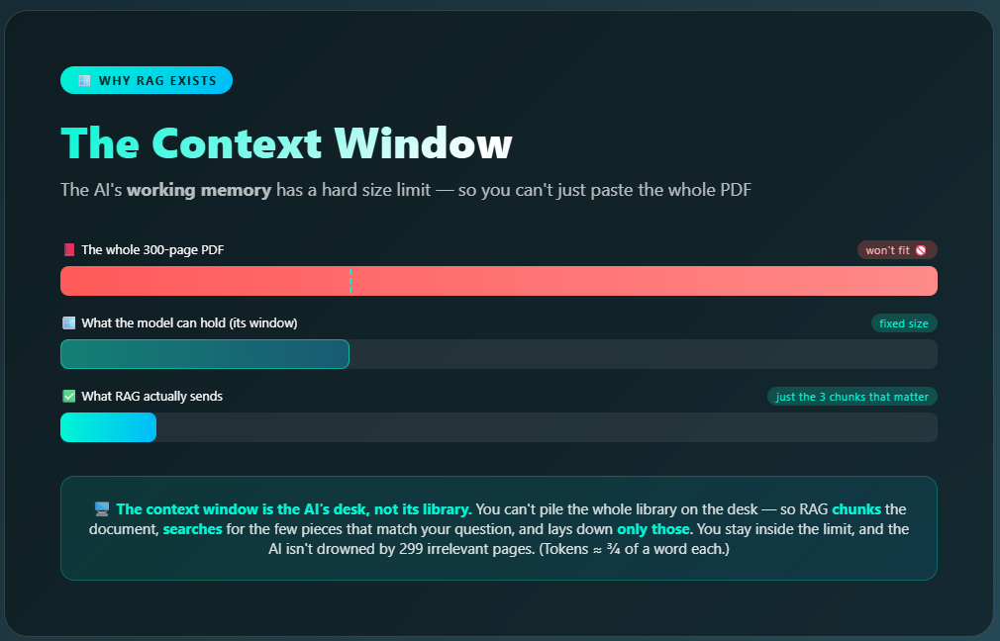
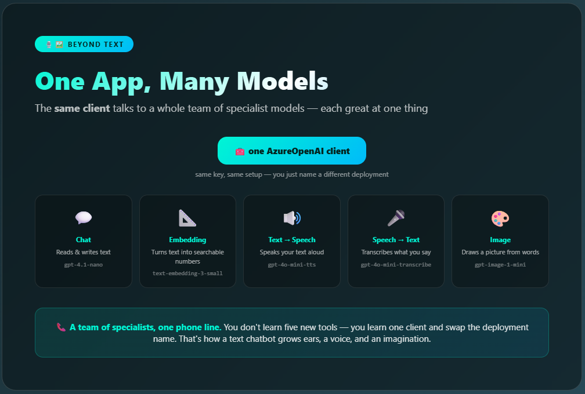

# 🔍 Lesson 4 — Explained

### Supplementary reading for *RAG & AI Models*

In this lesson you give an AI an **open book**: upload *any* document and it answers using **only** what's actually in your file — a technique called **RAG**. Then you give your app **more senses** — it listens to a spoken question, answers out loud, and even generates images. This guide breaks down how each piece works — no scary math, just the mental models that make it click.


---

## 0. The big build — start here 🚀


<!-- Screenshot of 0_lesson_overview.html goes here -->

Before any code, this is the **whole map** of the lesson. It shows the three things you'll build — a **PDF Q&A** app, a **voice** assistant, and an **image** generator — the four stages that get you there, and the idea that ties them together: one AI client talking to a whole **team of specialist models**.

Use it to get your bearings: every card below is one piece of this map. When you feel lost, come back here and find where you are.

> 🗺️ **Mental model:** it's the trail map at the start of a hike. You don't need every detail yet — just the shape of where you're going and what "done" looks like.

---

## 1. What is RAG (and why it matters) 🔍


<!-- Screenshot of 1_what_is_rag.html goes here -->

**RAG = Retrieval-Augmented Generation.** Long name, simple idea.

Normally when you ask an AI a question, it answers from memory — whatever it learned during training. The problem? It might **hallucinate**: make up a confident-sounding answer that's totally wrong. It has no idea what's in *your* specific document.

RAG fixes this by giving the AI an **open book**:

```
Without RAG:  Question → AI guesses → 😬 maybe wrong
With RAG:     Question → find the real paragraphs → AI reads them → ✅ grounded answer
```

> 📖 **The analogy:** a closed-book exam forces you to answer from memory (and bluff when unsure). RAG turns it into an **open-book exam** — look up the real answer first, *then* respond. Way more reliable.

This is how "chat with your PDF" tools, customer support bots, and AI research assistants all work.

---

## 2. Chunking: slicing the document ✂️


<!-- Screenshot of 2_chunking.html goes here -->

A 40-page PDF is way too big to hand to an AI all at once. So step one is to **chop it into chunks** — small pieces of a few hundred characters each.

But here's a subtle trick: the chunks **overlap** slightly. The last ~50 characters of one chunk repeat at the start of the next.

> 🍕 **Why overlap?** Imagine a key sentence gets cut exactly in half at a chunk boundary. Without overlap, its meaning is split and might get lost. With overlap, the full idea survives in *both* pieces — like leaving a little cheese-pull connecting your pizza slices so nothing falls apart.

In your app, this is the `split_into_chunks(text, chunk_size=500, overlap=50)` function. Try changing those numbers and watch how the chunks change!

---

## 3. Embeddings: turning meaning into numbers 🧬


<!-- Screenshot of 3_embeddings.html goes here -->

This is the coolest (and weirdest) part. An **embedding** is a long list of numbers that represents the *meaning* of a piece of text.

The magic: **similar meanings get similar numbers.**

```
"puppy"  →  [0.91, 0.12, 0.88, ...]
"dog"    →  [0.89, 0.15, 0.85, ...]   ← almost identical numbers!
"car"    →  [0.10, 0.93, 0.04, ...]   ← totally different
```

Picture a giant invisible map where every word and sentence has a location. "Puppy," "dog," and "pet" cluster together in one neighborhood. "Car" and "vehicle" sit in a different part of town. The *numbers are the meaning* — that's how a computer can finally "understand" language without actually reading it.

---

## 4. Finding the best match 📐


<!-- Screenshot of 4_finding_the_match.html goes here -->

Now we can search by **meaning** instead of keywords. When you ask a question:

1. We embed your question into numbers too
2. We compare it against every chunk's numbers
3. We keep the **top 3 closest** chunks

The comparison uses **cosine similarity** — a fancy name for "do these two point in the same direction?" Small angle = very similar meaning = high score (close to 1.0). Big angle = unrelated = low score.

```
Question: "How do I return an item?"
  Refunds §4   ████████████████░░  0.92  ← TOP MATCH
  Shipping §2  ███████████░░░░░░░  0.61
  About Us §1  ███░░░░░░░░░░░░░░░  0.18
```

Notice it found the **Refunds** section even though your question said "return," not "refund." That's the power of searching by meaning — keywords would've missed it.

---

## 5. The full pipeline, start to finish 🔧


<!-- Screenshot of 5_rag_pipeline.html goes here -->

Put it all together and RAG has **two phases**:

**Phase 1 — Prep (happens once, when you upload):**
1. 📄 Upload PDF → extract text
2. ✂️ Chunk it → overlapping pieces
3. 🧬 Embed → turn each chunk into numbers
4. 🗄️ Store → keep them ready to search

**Phase 2 — Answer (every time you ask):**
1. ❓ Your question → embed it
2. 📐 Find matches → grab the 3 closest chunks
3. 🤖 Ask the AI → question + chunks together
4. ✨ Grounded answer → uses ONLY your document

That's it. You built a real AI search engine. 🏆

---

## 6. The context window: why the AI can't read your whole PDF 🪟


<!-- Screenshot of 7_context_window.html goes here -->

Here's the question that explains *why* RAG even exists: if the AI is so smart, why not just paste the entire 300-page PDF into the prompt and ask away?

Because every AI model has a **context window** — a hard limit on how much text it can hold in its "working memory" at once, measured in **tokens** (roughly ¾ of a word each). Go over the limit and the request simply fails — or quietly forgets the earlier parts.

```
The whole PDF:   ████████████████████████████████  way too big 🚫
Context window:  ██████████                         fixed size
What you send:   ███   (just the 3 chunks that actually matter) ✅
```

So instead of cramming everything in, RAG is smart about it: **chunk** the document, **search** for the few pieces that match the question, and send **only those**. You stay safely inside the window *and* the AI isn't distracted by 299 irrelevant pages.

> 🪟 **Mental model:** the context window is the AI's **desk**, not its library. You can't dump the whole library on the desk — so you fetch just the few pages you need and lay those down. That "fetch the right pages first" step is the heart of every RAG system.

---

## 7. More senses: one app, many AI models 🎙️🖼️


<!-- Screenshot of 6_multimodal.html goes here -->

So far you've used *two* different AI models without noticing: a **chat** model (writes answers) and an **embedding** model (turns text into numbers). Now you add a few more — because there's no single "AI" that does everything. Each job has a **specialist model**:

| Job | Model type | Example |
|-----|-----------|---------|
| Write / answer | Chat | gpt-4.1-nano |
| Meaning → numbers | Embedding | text-embedding-3-small |
| Text → speech | TTS | gpt-4o-mini-tts |
| Speech → text | STT | gpt-4o-mini-transcribe |
| Text → image | Image | gpt-image-1-mini |

The beautiful part: it's the **same client object** every time — you just call a different method (`chat.completions`, `embeddings`, `audio.speech`, `images.generate`). Chain them together and one app can read, listen, speak, and draw.

> 🧩 **Mental model:** you're not hiring one genius who does everything — you're assembling a *team* of specialists, each great at one thing, all reachable through one phone line (your client).

---

## 🎯 The big picture

| Concept | What it really is | Where it's used in the real world |
|---------|-------------------|-----------------------------------|
| **RAG** | AI + an open book | ChatGPT file uploads, support bots |
| **Chunking** | Breaking big text into pieces | Every document AI tool |
| **Embeddings** | Meaning as coordinates | Search engines, recommendations |
| **Cosine similarity** | Measuring "closeness" of meaning | Spotify/Netflix recommendations |
| **Multimodal models** | One client, many specialist models | Voice assistants, image tools, Copilot |

The same techniques that let your app answer questions about a PDF also power Netflix suggestions, Spotify's "songs like this," and Google search. You're learning the engine behind modern AI. 🚀

---
