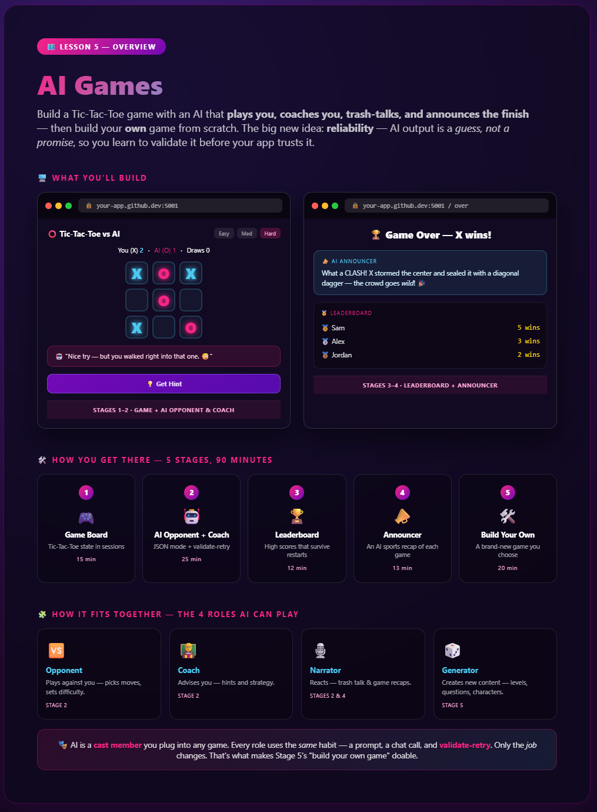
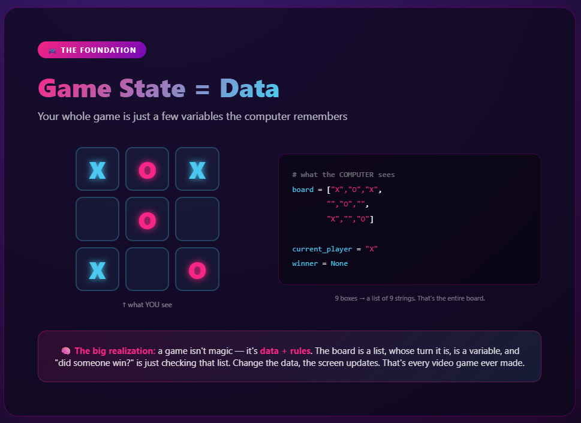
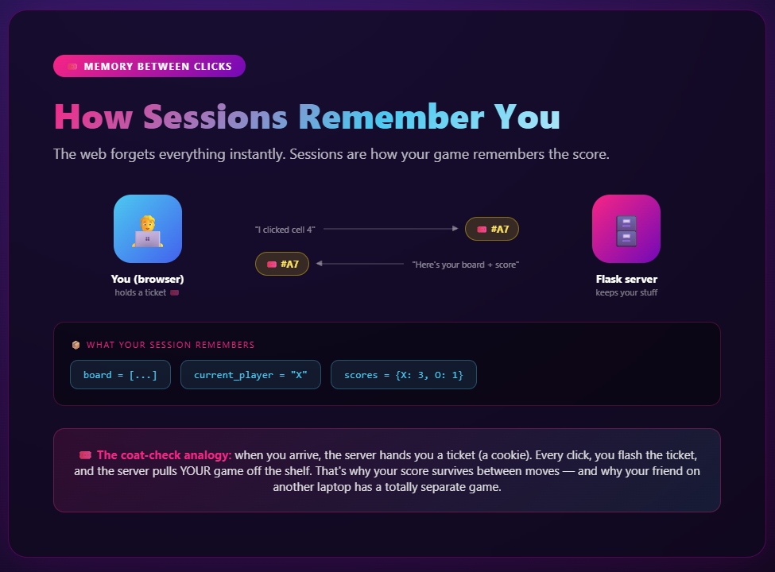
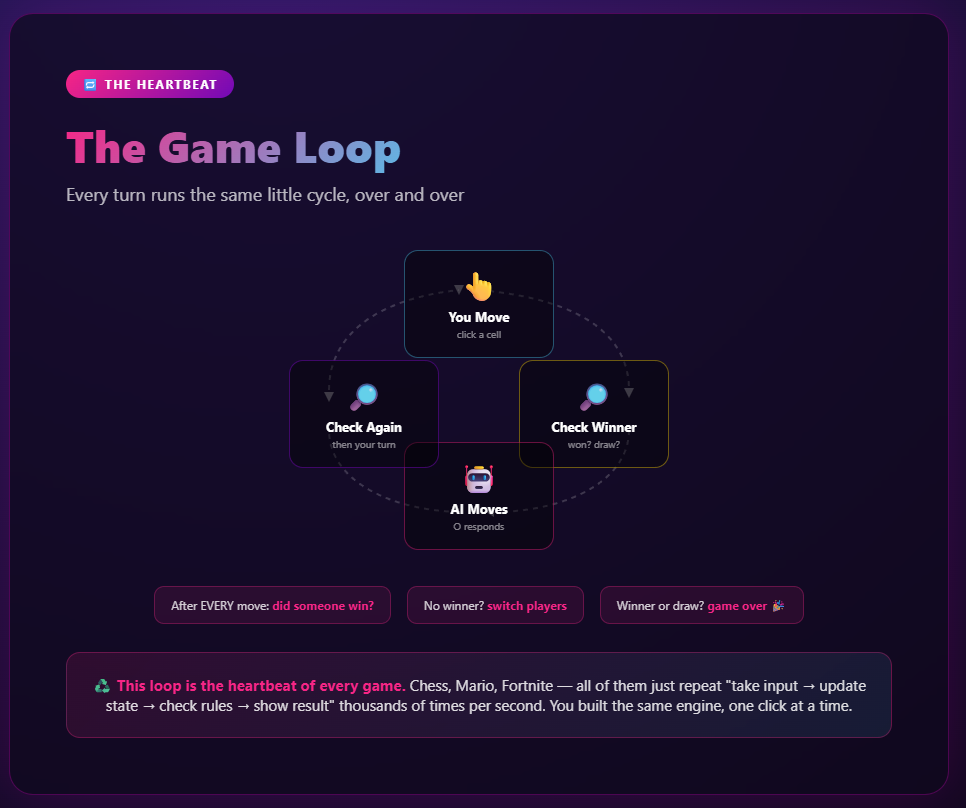
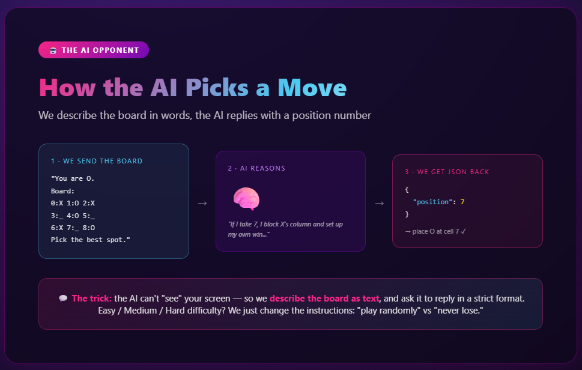
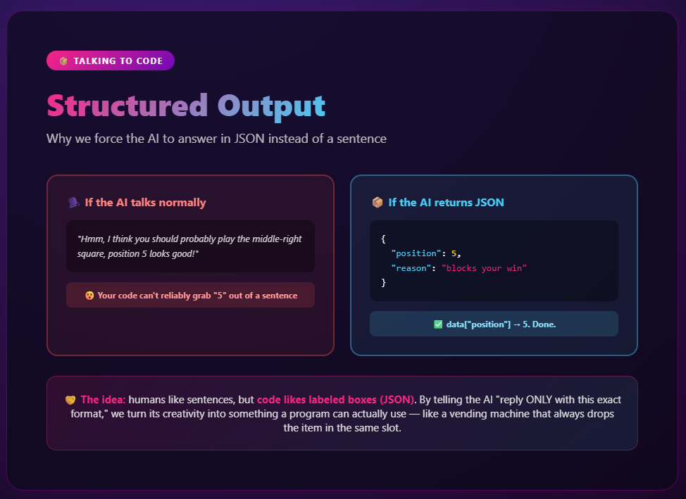
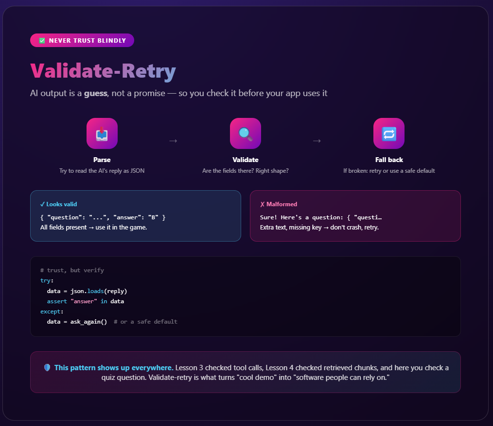
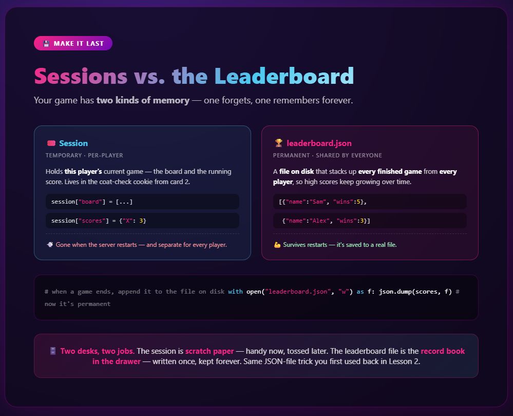
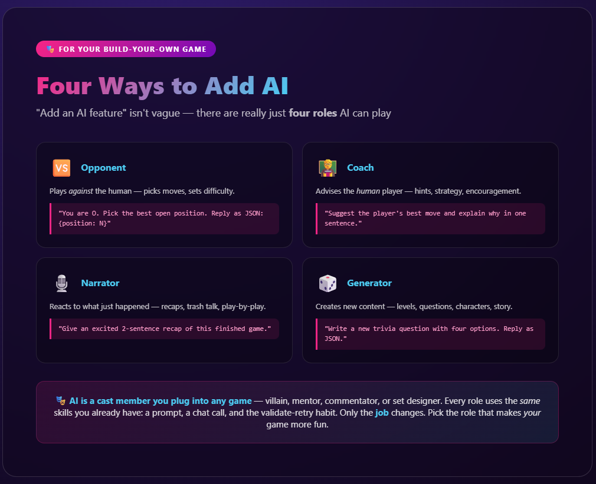

# 🎮 Lesson 5 — Explained

### Supplementary reading for *AI Games*

In this lesson you build a Tic-Tac-Toe game with an AI that plays you, coaches you, trash-talks, and announces the finish — then you build your *own* game from scratch. Games feel like magic, but under the hood they're just **data + rules**. This guide reveals the machinery — and the lesson's big new idea: **reliability** (AI output is a guess, not a promise, so you check it before your app trusts it).


---

## 0. The big build — start here 🚀


<!-- Screenshot of 0_lesson_overview.html goes here -->

Before any code, this is the **whole map** of the lesson. It shows what you'll build — a Tic-Tac-Toe game with an AI opponent, coach, trash-talk, leaderboard, and announcer — the five stages that get you there, and the idea that ties it together: the **four roles** AI can play in any game.

Use it to get your bearings: every card below is one piece of this map. When you feel lost, come back here and find where you are.

> 🗺️ **Mental model:** it's the trail map at the start of a hike. You don't need every detail yet — just the shape of where you're going and what "done" looks like.

---

## 1. A game is just data + rules 🎮


<!-- Screenshot of 1_game_state.html goes here -->

Here's the secret that makes everything else click: **a game isn't magic — it's data.**

That Tic-Tac-Toe board you see on screen? To the computer, it's just a list of 9 strings:

```python
board = ["X", "O", "X",
         "",  "O", "",
         "X", "",  "O"]

current_player = "X"
winner = None
```

The board is a **list**. Whose turn it is, is a **variable**. "Did someone win?" is just **checking that list**. Change the data → the screen redraws. That's the entire concept behind *every* video game ever made, from Pong to Elden Ring. The graphics get fancier, but it's always "state" (data) plus "rules" (code).

---

## 2. Sessions: how your game remembers you 🎟️


<!-- Screenshot of 2_sessions.html goes here -->

Here's a weird truth about the web: **it forgets everything instantly.** Each time you click, the server has no memory of who you are or what your score was. So how does your game keep score across moves?

**Sessions.** Think of it like a **coat check at a fancy event**:

1. You arrive → the server hands you a numbered ticket (a "cookie" in your browser) 🎟️
2. Every time you click, you flash your ticket
3. The server uses the number to pull *your* game off the shelf

That's why your score survives between moves — and why your friend playing on another laptop gets a totally separate game. In code it looks like `session["board"]` and `session["scores"]`.

---

## 3. The game loop: the heartbeat 🔁


<!-- Screenshot of 5_game_loop.html goes here -->

Every turn runs the same little cycle:

1. 👆 **You move** — click a cell
2. 🔎 **Check winner** — did that win? Is it a draw?
3. 🤖 **AI moves** — O responds
4. 🔎 **Check again** — then back to your turn

The golden rule: **after every single move, check if the game is over.** No winner? Switch players and loop. Winner or full board? Game over. 🎉

> ♻️ **The mind-blow:** this exact loop powers *every* game. Chess, Mario, Fortnite — they all just repeat "take input → update state → check rules → show result," sometimes thousands of times per second. You built the same engine, one click at a time.

---

## 4. How the AI opponent picks a move 🤖


<!-- Screenshot of 3_ai_opponent.html goes here -->

The AI can't actually *see* your screen. So how does it play? We **describe the board as text** and ask it to reply:

```
We send:  "You are O. Board: 0:X 1:O 2:X / 3:_ 4:O 5:_ / 6:X 7:_ 8:O.
            Pick the best open position."

AI thinks: "If I take 7, I block X and set up my own win..."

AI replies: { "position": 7 }
```

And the difficulty levels? We just change the *instructions*:
- **Easy** → "pick a random open spot"
- **Medium** → "try to win or block"
- **Hard** → "play perfectly, never lose"

Same AI, different personality — all controlled by the prompt you write.

---

## 5. Structured output: making AI talk to code 📦


<!-- Screenshot of 4_structured_output.html goes here -->

This is a *huge* real-world skill. Normally an AI replies in friendly sentences:

> *"Hmm, I think you should probably play the middle-right square, position 5 looks good!"*

That's nice for humans, but your code can't reliably yank "5" out of a sentence. So instead we force the AI to reply in **JSON** — labeled boxes that code understands:

```json
{ "position": 5, "reason": "blocks your win" }
```

Now your code just reads `data["position"]` → `5`. Done. 🎯

> 🤝 **The principle:** humans like sentences, code likes labeled boxes. "Structured output" is how you bridge the two — it's used everywhere from chatbots to self-driving cars.

---

## 6. Validate-retry: trusting AI output safely ✅


<!-- Screenshot of 6_validate_retry.html goes here -->

Structured output (JSON) is great — *when it works*. But sometimes the AI returns garbage: a position that's already taken, a number out of range, or text that isn't valid JSON at all. If your code trusts it blindly, the game crashes. 💥

The fix is a 3-step habit: **parse → validate → fall back.**

```python
try:
    move = json.loads(ai_reply)             # 1. parse
    if move["position"] not in open_cells:  # 2. validate
        raise ValueError("illegal move")
except (json.JSONDecodeError, ValueError, KeyError):
    move = random.choice(open_cells)        # 3. fall back (or retry)
```

Never ship "happy-path only" AI code. Real AI output is *usually* right — which is exactly why the rare wrong answer is so dangerous if you're not checking.

> ♻️ **The pattern that follows you everywhere:** you first met it in Lesson 3 (tool arguments) and Lesson 4 (grounded answers). Here it guards game moves. "AI proposes, your code verifies" is the backbone of every reliable AI system.

---

## 7. Persistence: sessions forget, files remember 💾


<!-- Screenshot of 8_persistence.html goes here -->

Your game has **two kinds of memory**. The **session** (card 2) holds *this player's* current board and score — but it's temporary: it vanishes when the server restarts, and every player has their own. For a real **leaderboard**, you need memory that's **permanent and shared**, so you save each finished game to a **JSON file on disk**.

```python
# when a game ends, write the scores to a file that survives restarts
with open("leaderboard.json", "w") as f:
    json.dump(scores, f)
```

Files survive restarts; sessions don't. That's the whole difference — and it's the same JSON-file trick you first used in Lesson 2, now powering a high-score table.

> 🗄️ **Mental model:** the session is **scratch paper** on your desk — handy now, tossed later. The leaderboard file is the **record book in the drawer** — written once, kept forever.

---

## 8. Four ways to drop AI into any game 🎭


<!-- Screenshot of 7_ai_roles.html goes here -->

When you build your *own* game in Stage 5, "add an AI feature" can feel vague. It isn't — there are really just **four roles** AI can play, and you can mix and match them:

| Role | What it does | Example prompt you'd send |
|------|-------------|---------------------------|
| 🆚 **Opponent** | Plays against the human | "You are O. Pick the best open position as JSON." |
| 🧑‍🏫 **Coach** | Advises the human player | "Suggest the player's best move and explain why in one sentence." |
| 🎙️ **Narrator** | Reacts to what happened | "Give an excited 2-sentence recap of this finished game." |
| 🎲 **Generator** | Creates new content | "Write a new trivia question with four options as JSON." |

Notice they all use the **same skills you already have**: a prompt, a chat call, and the validate-retry habit for anything the AI sends back. The only thing that changes is the *job* you give the AI.

> 🎭 **Mental model:** AI is a **cast member** you can plug into any game — villain, mentor, commentator, or set designer. Pick the role that makes *your* game more fun, then describe the job clearly in the prompt. That's the whole move.

---

## 🎯 The big picture

| Concept | What it really is | Where you'll see it again |
|---------|-------------------|---------------------------|
| **Game state** | Data that describes "right now" | Every app, every game |
| **Sessions** | Remembering a user between clicks | Logins, shopping carts, high scores |
| **AI + text** | Describing the world for the AI | Every AI agent you'll ever build |
| **Structured output (JSON)** | Forcing AI into code-friendly format | Production AI systems everywhere |
| **Validate-retry** | Checking AI output before you trust it | Every reliable AI product |
| **Persistence** | Saving data to a file so it survives restarts | Leaderboards, save files, databases |
| **The game loop** | Input → update → check → render | All of interactive computing |

You didn't just make a game. You learned how state, memory, and AI decision-making fit together — the foundation of basically all interactive software. Now go build something nobody's seen before. 🚀
