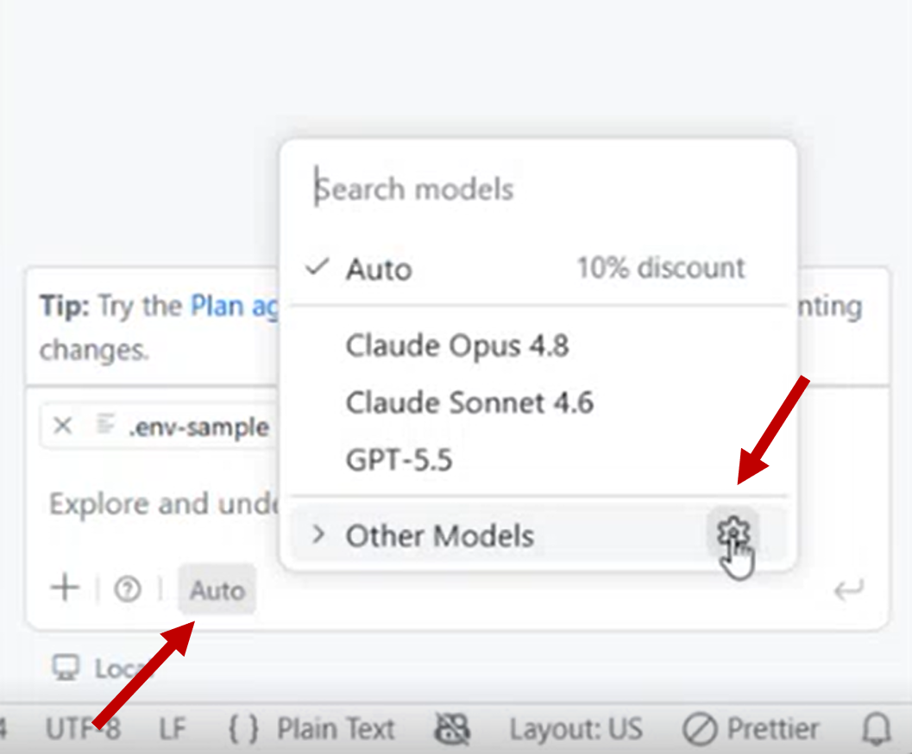
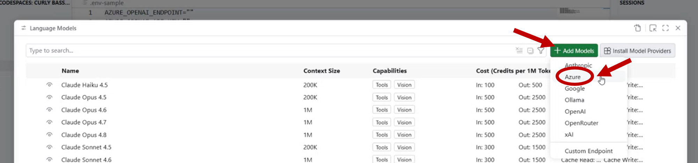
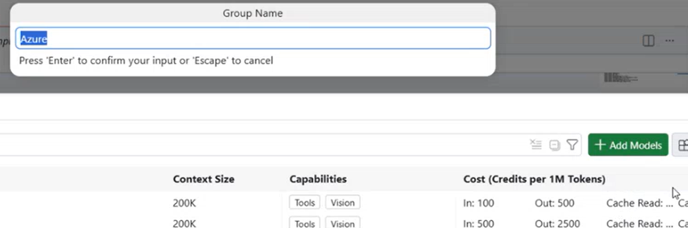
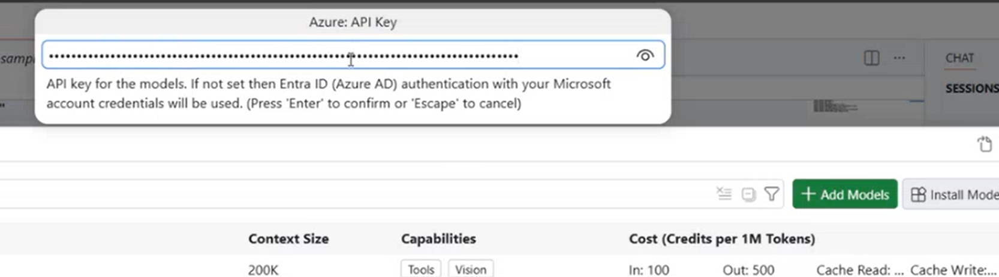
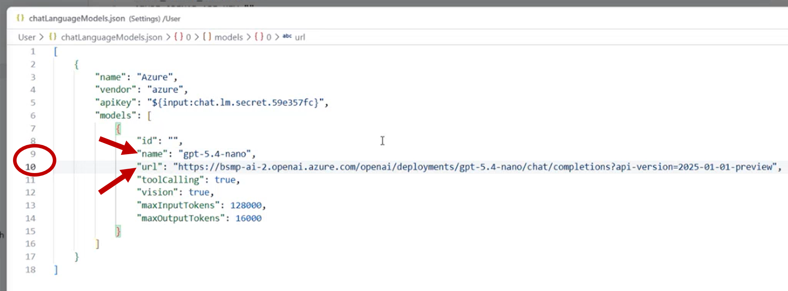
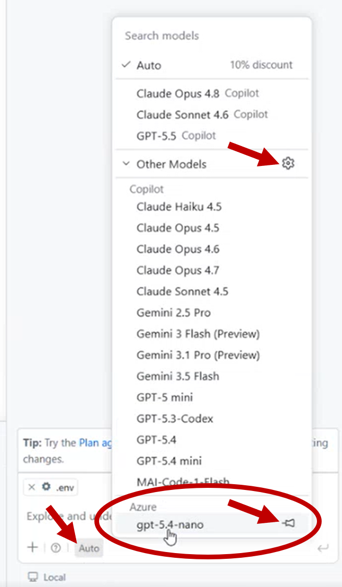
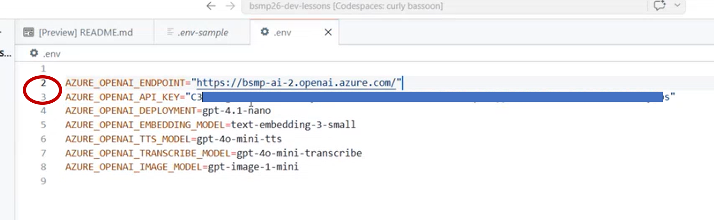

# 🔑 Adding the BSMP Azure AI Models to Your Codespace (BYOK) <!-- {docsify-ignore-all} -->

In this class, you'll use **GitHub Copilot in agent mode** with **BSMP's own Azure AI models** instead of relying on limited free credits. This is called **BYOK** — *Bring Your Own Key*.

This page walks you through **two things you'll set up at the start of every class**:

1. **Add the BSMP model to GitHub Copilot** (so you can use it in agent mode), and
2. **Create your `.env` file** (so your app code can call the model).

?> ⏱️ **Do this at the beginning of every class.** Codespaces may reset between sessions, so you'll re-add the model and re-create your `.env` file each time. It only takes a minute once you've done it once.

<br>

---

## 📍 Step 0: Find Your Chapter's Keys

All of the model info you need — the **endpoint**, **API key**, **deployment/model name**, and **API version** — lives in a **Loop page on the BSMP Team site in your tenant**.

> Open the Loop page titled **"AI Models and Keys"** and find the section for **your chapter / location**.

Your chapter section will list something like:

| Field | Example value |
|-------|----------------|
| Copilot Chat model — used in **Part 1** | `gpt-5.4-nano` |
| App deployment — `AZURE_OPENAI_DEPLOYMENT`, used in **Part 2** | `gpt-5-nano` |
| Endpoint | `https://<your-chapter-resource>.openai.azure.com/` |
| API Key | `••••••••••••••••` |
| API Version | `2026-xx-xx` |

!> 🔒 **Keep your keys private.** These keys are shared just for class. Don't post them in public repos, chats, or your final project video.

> 📌 Find the model info for **your chapter** here:
> **[BSMP Loop → AI Models and Keys](#)** *(replace with the Loop link)*


<br>

---

## 🧩 Part 1: Add the Model to GitHub Copilot

This lets you select the BSMP model when using **Copilot agent mode**.

### Step 1 — Open the model picker

In your Codespace, open the **Copilot Chat** panel and click the **model selector** dropdown (where the current model name is shown). It might currently say **`Auto`** (the default) — that's fine; click it anyway.

### Step 2 — Choose "Manage Models" / "Add Model"

At the bottom of the model list, click the **⚙️ Manage Models** (or **Add a model**) option.



### Step 3 — Click Add Model and Select "Azure" as the provider

At the top right in green should be a button to "Add Models". Select that. When prompted for a provider, choose **Azure**.



Hit enter as well to use `Azure` as the Group Name. 




### Step 4 - Enter in the API key

Copy the API Key from the **AI Models and Keys** Loop page and paste it when prompted like so and then hit `Enter`:



### Step 5 — Enter your chapter's model details

Copy the values from your chapter's **AI Models and Keys** Loop page and update lines 9 and 10 in the `chatLanguageModels.json`. 

- line 9 `name` update model name to: `gpt-5.4-nano`
- line 10 `url` update to the model url: `https://....openai.azure.com/`



### Step 6 — Select your model

Back in the model dropdown, you may need to expand **Other Models…** at the bottom of the list to find your newly added **BSMP Azure model**. Select it — you're now ready to use it in **agent mode**! ✅



<br>

---

## 📄 Part 2: Create Your `.env` File

Your app code (the chatbots and agents you build) reads the model info from a **`.env` file** in your project. You'll create this from the provided **`.env-sample`** in the repo root.

### Step 1 — Copy the sample

In the terminal inside your Codespace, run:

```bash
cp .env-sample .env
```

### Step 2 — Fill in your chapter's values

Open `.env` and paste in the values from your chapter's **AI Models and Keys** Loop page:

```bash
AZURE_OPENAI_ENDPOINT="https://<your-chapter-resource>.openai.azure.com/"
AZURE_OPENAI_KEY="<your-chapter-api-key>"
AZURE_OPENAI_DEPLOYMENT="gpt-5-nano"
AZURE_OPENAI_API_VERSION="2026-xx-xx"
```




!> ⚠️ **Never commit your `.env` file.** It's already in `.gitignore` so your keys stay out of GitHub — keep it that way.

### Step 3 — Confirm it's working

Run the lesson's starter app (for most lessons this is):

```bash
python app.py
```

If the app starts and your AI chat responds, you're all set! 🎉

<br>

---

## ✅ Quick Start Checklist (Every Class)

- [ ] Open the lesson repo in **Codespaces**
- [ ] Open the **"AI Models and Keys"** Loop page → find **your chapter**
- [ ] **Part 1:** Add the BSMP Azure model to Copilot and select it in the model dropdown
- [ ] **Part 2:** `cp .env-sample .env` and paste in your chapter's endpoint, key, deployment, and API version
- [ ] Run the app (`python app.py`) and confirm the AI responds

<br>

---

## 🆘 Troubleshooting

- **"Too many requests" / rate limited?** The class model can get busy. Let your instructor know — there's a **backup model** you can switch to using the same steps in Part 1.
- **App can't find the key?** Make sure your file is named exactly `.env` (not `.env.txt`) and is in the project root.
- **Model not showing in Copilot?** Re-open the model dropdown and confirm you selected the BSMP Azure model, not the default.
- **Still stuck?** Bring it to **office hours (Mondays, 2 PM EST)** or ask a mentor in class.
