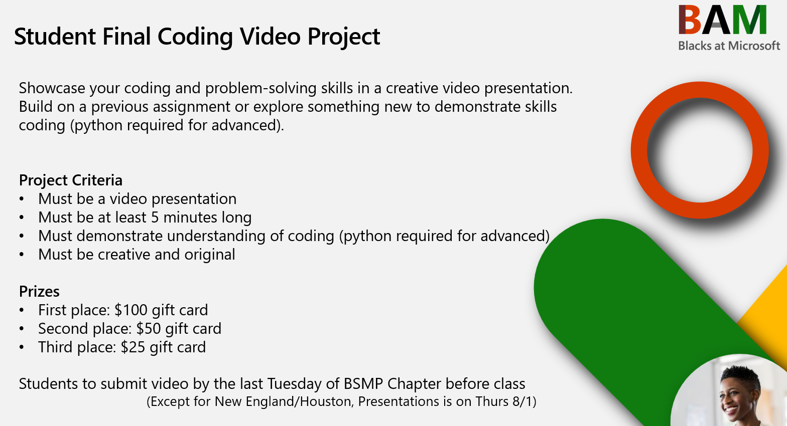
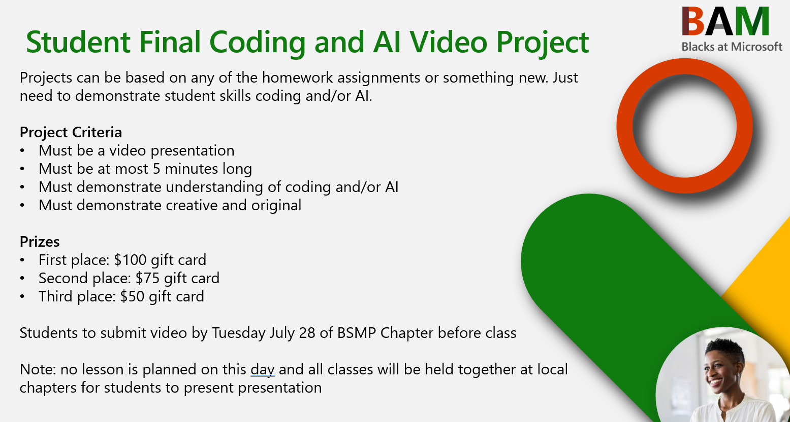

<!-- /final_student_video_project/README.md 

-->  

!> All projects should be submitted by **`Monday, July 27 @ Midnight`** so team has time to review, and will be presented at your local BSMP chapter.

> [!NOTE]
> 
> **Student Coding Project Submission form:** [Link Placeholder]
>
>
> **Judging Criteria Objectives**
> * Delivery - preparation and delivery of project/code/demo confidently
> * Content - presentation clearly identified the problem and presented/demo a solution
> * Creativity and Originality - the presentation should be creative and original. extra points for those that come up with a unique and interesting way to present their topic, and use code/ai and visualizations in a way that is both informative and engaging.
> 

----

#### 🎓 Advance 2025 - World Wide Winners

<!-- tabs:start -->

##### **2025 Winner 🥇**

**Artificial Weapons: Using AI to Create Fantasy Systems for the Unlikely Hero**

Surrounding the Generational AI aspect of the game involving weapon creation, I made a turn-based RPG surrounding a max level playing trying to survive a dungeon for as long as possible. You can consume items and quip stronger weapons that scale to the number of battles you've triumphed. Be sure to play it smart, however, because some enemies are much more fierce than others and can take you or the Noob out.

<video controls style="width:100%; height:auto;">
    <source src="https://nfl2k25cdn-gxcnhdfjbjfndnck.z01.azurefd.net/nflblob/bsmp/bsmp_proj_vids/Artificial%20Weapons%20Using%20AI%20to%20Create%20Fantasy%20Systems%20for%20the%20Unlikely%20Hero%20-%20Adon%20Smith%20Griffin.mp4" type="video/mp4">
    Your browser does not support the video tag.
</video>

> YouTube Link: [https://youtu.be/8R0c2tVMN-A](https://youtu.be/8R0c2tVMN-A)

##### **🥈**

**QuizCrawler**

Imagine if, instead of studying from notes, you could play a roguelike game that turns any subject into an adventure. That’s Quizcrawlers—it uses Azure, Dall E, TTS, and Sora to create a fun, AI-powered educational game where you answer questions, battle bosses, and learn as you play.

<video controls style="width:100%; height:auto;">
    <source src="https://nfl2k25cdn-gxcnhdfjbjfndnck.z01.azurefd.net/nflblob/bsmp/bsmp_proj_vids/Video%20Project_Roohaan%20Ahmad.mp4" type="video/mp4">
    Your browser does not support the video tag.
</video>

##### **🥉**

**TLDR.tech**

tldr.tech is a web app designed to simplify the overwhelming world of tech news by delivering curated, AI-summarized headlines in one place. Users can filter news based on their mood, helping protect their mental health while staying informed. The app also includes a tech dictionary with AI-powered definitions and interactive games like quizzes and work match to make learning fun. With features like a floating AI assistant and daily time limits, tldr.tech blends information, wellness, and engagement into one thoughtful experience.

<video controls style="width:100%; height:auto;">
    <source src="https://nfl2k25cdn-gxcnhdfjbjfndnck.z01.azurefd.net/nflblob/bsmp/bsmp_proj_vids/AliyaLaliwalaCodingVideoFull%20(1)_Aliya%20Laliwala.mp4" type="video/mp4">
    Your browser does not support the video tag.
</video>

##### **Honorable Mentions**

(No Particular Order)

<!-- tabs:start -->

##### **InterviewOS**

<video controls style="width:100%; height:auto;">
    <source src="https://nfl2k25cdn-gxcnhdfjbjfndnck.z01.azurefd.net/nflblob/bsmp/bsmp_proj_vids/Paul_Hackathon_Submission_Damilare%20Oladele.mp4" type="video/mp4">
    Your browser does not support the video tag.
</video>

##### **Blast Through The Past**

<video controls style="width:100%; height:auto;">
    <source src="https://nfl2k25cdn-gxcnhdfjbjfndnck.z01.azurefd.net/nflblob/bsmp/bsmp_proj_vids/Temi's%20Final%20Coding%20Project_Temidire%20Durojaye%201.mp4" type="video/mp4">
    Your browser does not support the video tag.
</video>

##### **BotBuilders Hub**

<video controls style="width:100%; height:auto;">
    <source src="https://nfl2k25cdn-gxcnhdfjbjfndnck.z01.azurefd.net/nflblob/bsmp/bsmp_proj_vids/BAM%20Coding%20and%20AI%20Video%20Project%204_Taylor%20Higgs.mp4" type="video/mp4">
    Your browser does not support the video tag.
</video>

<!-- tabs:end -->

##### **Other Noteble Awesome Projects**

(No Particular Order)

<!-- tabs:start -->

##### **Fluenity**

Fluenity is a web app that uses AI to help you learn languages more effectively. It generates customized lessons with built-in practice that helps you learn words you use in real-life. It also has an AI tutor that specializes in answering questions that help you understand languages better.

<video controls style="width:100%; height:auto;">
    <source src="https://nfl2k25cdn-gxcnhdfjbjfndnck.z01.azurefd.net/nflblob/bsmp/bsmp_proj_vids/BAM%20Coding%20and%20AI%20Program%20Entry_%20Fluenity%20-%20M_Philip%20Adefila.mp4" type="video/mp4">
    Your browser does not support the video tag.
</video>

> YouTube Link: [https://www.youtube.com/watch?v=necPEftZ3Lw](https://www.youtube.com/watch?v=necPEftZ3Lw)

##### **AI Biz Insight Dashboard**

An AI-powered business insight dashboard designed to help small and minority-owned businesses understand customer feedback, get actionable advice, and visualize financial trends. It uses Azure OpenAI to analyze customer sentiment, generate tailored business suggestions, and forecast revenue and expenses. Additional features include an interactive revenue vs expenses chart, a profitability calculator, and a notes section to support real-time business planning.

<video controls style="width:100%; height:auto;">
    <source src="https://nfl2k25cdn-gxcnhdfjbjfndnck.z01.azurefd.net/nflblob/bsmp/bsmp_proj_vids/AASHIRYA%20VARMA%20-%20CodingProject_Aashirya%20Varma.mp4" type="video/mp4">
    Your browser does not support the video tag.
</video>

> YouTube Link: [https://www.youtube.com/watch?v=h8IZfkc69s0](https://www.youtube.com/watch?v=h8IZfkc69s0)

##### **MolecuViz**

MolecuViz is a website to help students learn about chemistry through interactive features such as 3D models and AI Chemistry Assistants. MolecuViz has a database of 26 molecules ranging from many types with its own 3D model and basic description/properties. The AI Chemistry Assistant allows for the user to ask questions and the user can print out a nice PDF of that specific molecule and its properties.

<video controls style="width:100%; height:auto;">
    <source src="https://nfl2k25cdn-gxcnhdfjbjfndnck.z01.azurefd.net/nflblob/bsmp/bsmp_proj_vids/Partho%20Biswas%20-%20Coding%20Project%20(Advanced)_Partho%20Biswas.mp4" type="video/mp4">
    Your browser does not support the video tag.
</video>

> YouTube Link: [https://youtu.be/aKlZ9-O2OOg](https://youtu.be/aKlZ9-O2OOg)

##### **Hollow Descent**

A souls-like dungeon crawler game with a custom currency system and a shop, with dozens of unique weapons, animations, abilities.

<video controls style="width:100%; height:auto;">
    <source src="https://nfl2k25cdn-gxcnhdfjbjfndnck.z01.azurefd.net/nflblob/bsmp/bsmp_proj_vids/Hollo%20Descent%20-%20Vihaan%20Parikh.mp4" type="video/mp4">
    Your browser does not support the video tag.
</video>

##### **Aurora Veil**

Its a self-made AI that can teach and help new and old. Completive Pokémon players, by teaching new players the skills required to compete, and for old players act as opponent to test out their teasm

<video controls style="width:100%; height:auto;">
    <source src="https://nfl2k25cdn-gxcnhdfjbjfndnck.z01.azurefd.net/nflblob/bsmp/bsmp_proj_vids/Aurora%20Veil%20-%20Ahmet%20Elci.mp4" type="video/mp4">
    Your browser does not support the video tag.
</video>

<!-- tabs:end -->

<!-- tabs:end -->

----

---

#### 🎓 Intermediate 2025 Winners

<!-- tabs:start -->

##### **2025 Winner 🥇**

**BEST OVERALL - Nolive - Graphic novel game**

A visual novel game coded in Bolt.new. it follows a simple few scenes including characters I designed when I was in Middle School, hence the subtitle for the game.

<video controls style="width:100%; height:auto;">
    <source src="https://nfl2k25cdn-gxcnhdfjbjfndnck.z01.azurefd.net/nflblob/bsmp/bsmp_proj_vids/lv_0_20250729002416_Nolivé%20Konan.mp4" type="video/mp4">
    Your browser does not support the video tag.
</video>

> YouTube Link: [https://www.youtube.com/watch?v=fhUD1VDyJDs](https://www.youtube.com/watch?v=fhUD1VDyJDs)

##### **🥈**

**MobilSheets**

<video controls style="width:100%; height:auto;">
    <source src="https://nfl2k25cdn-gxcnhdfjbjfndnck.z01.azurefd.net/nflblob/bsmp/bsmp_proj_vids/mobil%20sheets%20demo(2)_Aaditya%20Aravind.mp4" type="video/mp4">
    Your browser does not support the video tag.
</video>

> YouTube Link: [https://youtu.be/2SAH8aECr7k](https://youtu.be/2SAH8aECr7k)

##### **🥉**

**The Onion: Satirical News with a Fake AI Twist**

<video controls style="width:100%; height:auto;">
    <source src="https://nfl2k25cdn-gxcnhdfjbjfndnck.z01.azurefd.net/nflblob/bsmp/bsmp_proj_vids/0727_vcvvoiNE_Faith%20Raymond.mp4" type="video/mp4">
    Your browser does not support the video tag.
</video>

##### **Honorable Mentions**

(No Particular Order)

<!-- tabs:start -->

##### **Focusify**

<video controls style="width:100%; height:auto;">
    <source src="https://nfl2k25cdn-gxcnhdfjbjfndnck.z01.azurefd.net/nflblob/bsmp/bsmp_proj_vids/Focusify%20Kyle%20S%20-%202025%20-%20KyleFN.mp4" type="video/mp4">
    Your browser does not support the video tag.
</video>

> YouTube Link: [https://youtu.be/M9sJvSP5lK4](https://youtu.be/M9sJvSP5lK4)

##### **Catch the Letters!**

<video controls style="width:100%; height:auto;">
    <source src="https://nfl2k25cdn-gxcnhdfjbjfndnck.z01.azurefd.net/nflblob/bsmp/bsmp_proj_vids/Solo%20Coding%20Project-20250728_214056-Meeting%20R_Gabriella%20McDonald.mp4" type="video/mp4">
    Your browser does not support the video tag.
</video>

##### **From Story to Signal: Our Truth, Our Tomorrow**

<video controls style="width:100%; height:auto;">
    <source src="https://nfl2k25cdn-gxcnhdfjbjfndnck.z01.azurefd.net/nflblob/bsmp/bsmp_proj_vids/Coding%20Project%20(1)_Annabelle%20Shodunke.mp4" type="video/mp4">
    Your browser does not support the video tag.
</video>

##### **Trip Assist**

<video controls style="width:100%; height:auto;">
    <source src="https://nfl2k25cdn-gxcnhdfjbjfndnck.z01.azurefd.net/nflblob/bsmp/bsmp_proj_vids/Coding%20Project_Joanna%20Blando.mp4" type="video/mp4">
    Your browser does not support the video tag.
</video>

<!-- tabs:end -->

<!-- tabs:end -->

---

