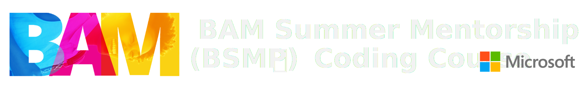

 <!-- background image style="max-width: 100%; height: auto;" alt="logo"-->

<b>Where to start?</b> Dive into the world of Coding and AI with a comprehensive program designed for high school students by Microsoft.

> Empower your future with advanced Python programming, AI tools, web development, and project-based learning.
> - 🌟 **Advanced Python Programming**
> - 📝 **AI Tools and Web Development**
> - 🎨 **Project-Based Learning**

[🚀 Get Started](students/Getting-Started.md)
[👉Check out GitHub BSMP-Coders](https://github.com/BSMP-Coders) 
[🧑‍🏫 About BSPM](program/bspm24_coding_program.md) 
[📘 Lesson Plan](/lessons/lesson_summary.md)
<!--[📘 Learning Resources](/program/learning_resources.md)⚠️-->
