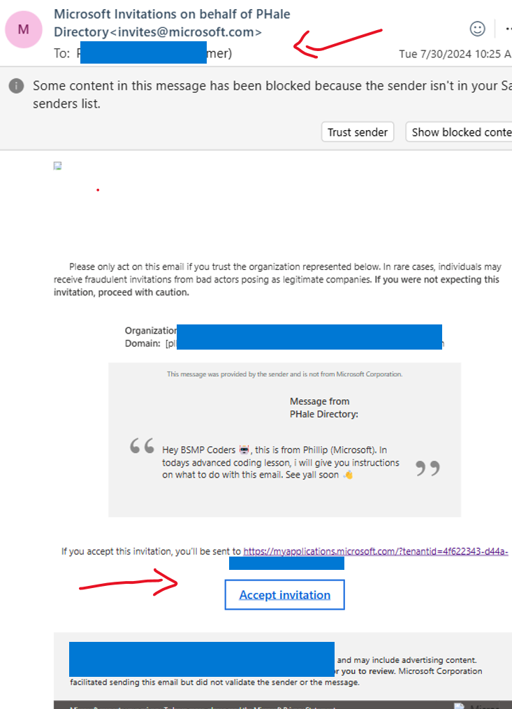
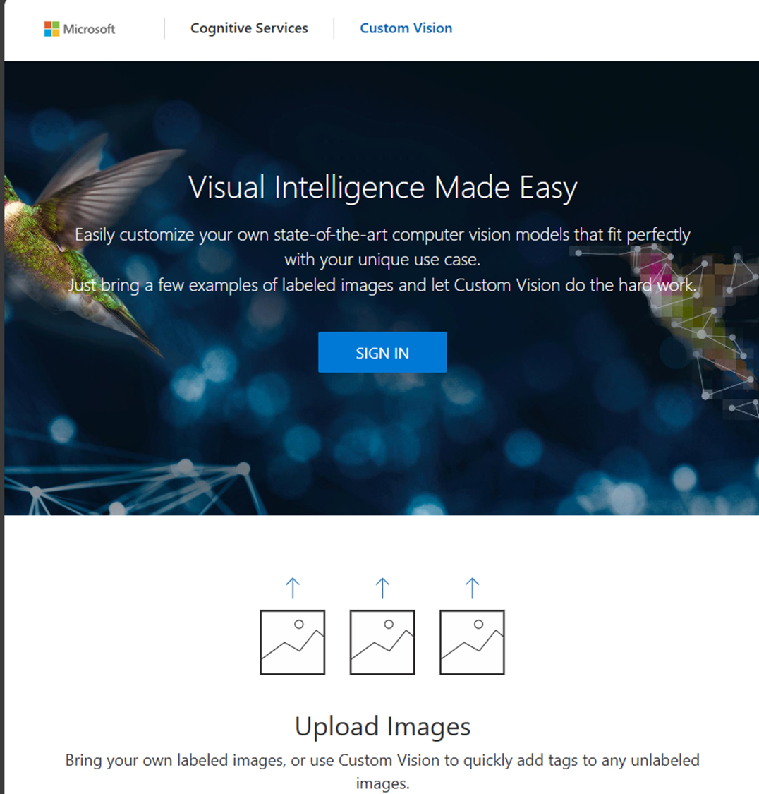
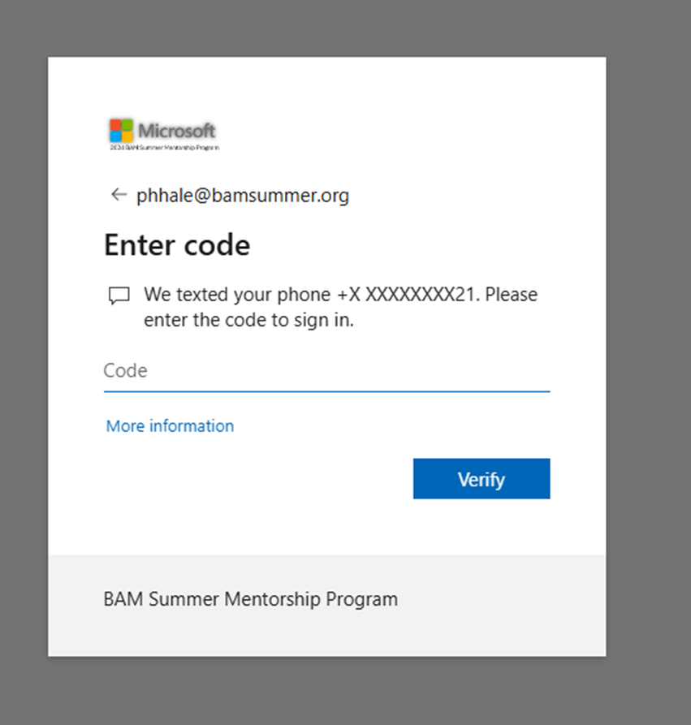
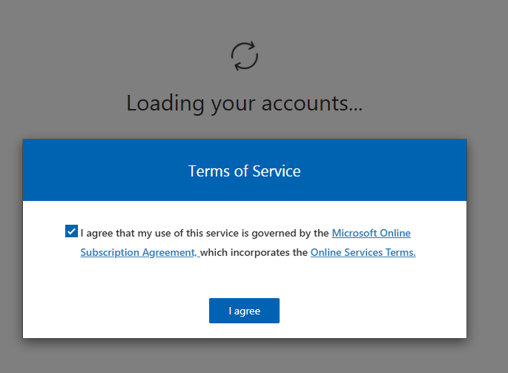
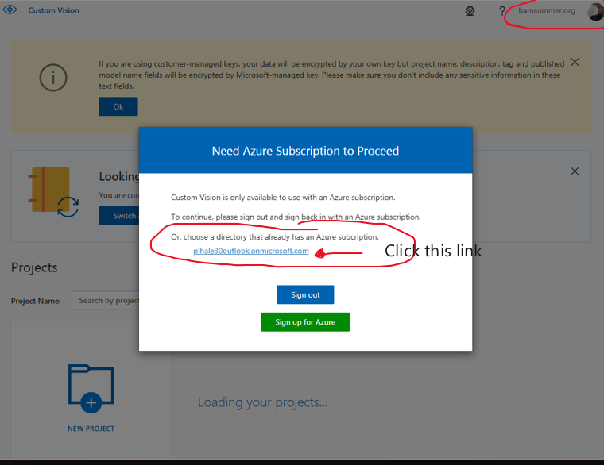
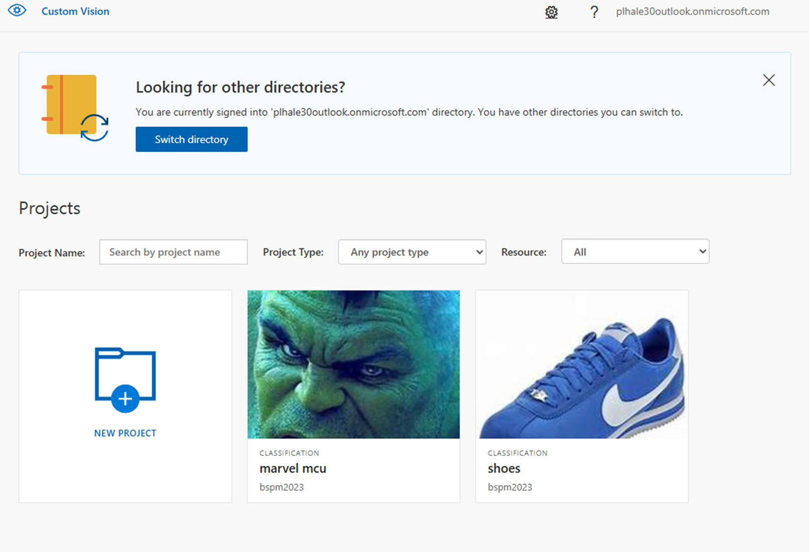

# BSMP Coding Students: How to Login to Custom Vision AI  
   
## Step-by-Step Instructions  
   
### Step 1: Accept the Invitation  
1. Check your BSMP email for an email titled "Microsoft Invitations on behalf of PHale Directory <invites@microsoft.com>."  
2. Open the email and click the "Accept invitation" button.  
3. If you don't receive this email, please notify me in the meeting.  
   

   
### Step 2: Sign In to Custom Vision AI  
1. Go to [https://www.customvision.ai/](https://www.customvision.ai/) and click on the "SIGN IN" button.  

👉 https://www.customvision.ai/ 

   
### Step 3: Authenticate via Text Code  
1. You may be prompted to authenticate via a text code.  
2. Enter the code you receive on your phone and click "Verify."  
   

   
### Step 4: Accept the Terms of Service  
1. You will be prompted to accept the Terms of Service.  
2. Check the box and click "I agree."  
   

   
### Step 5: Select the Correct Directory  
1. When you see the "Need Azure Subscription to Proceed" message, click on the `plhale30outlook.onmicrosoft.com` directory link.  
   

### Step 6: Verify Setup  
1. If everything is set up correctly, you will see a dashboard with available projects.  
2. This confirms that you are ready to begin the lesson on computer vision.  
   

   
If you encounter any issues during these steps, please let me know immediately.  