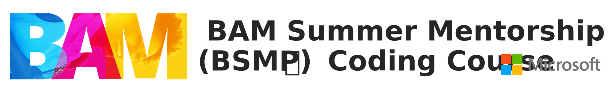
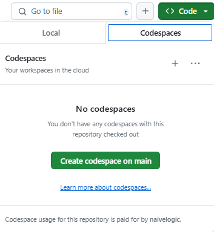
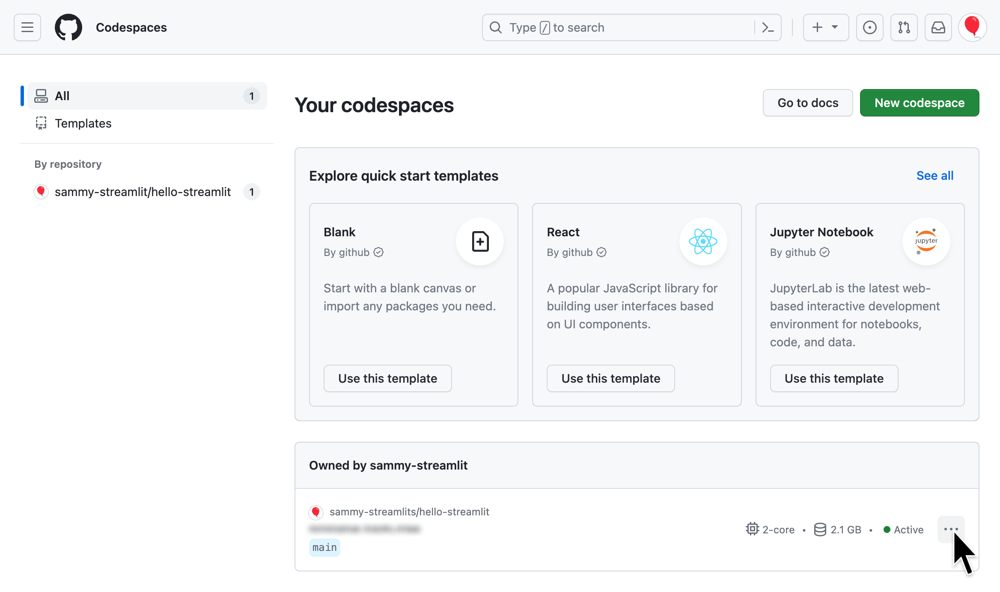
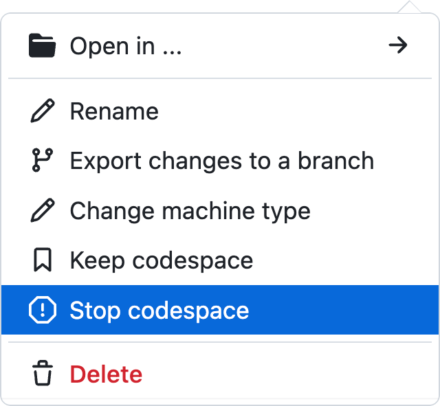
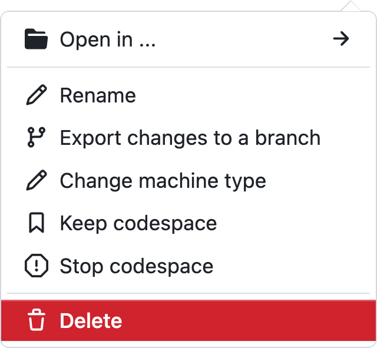
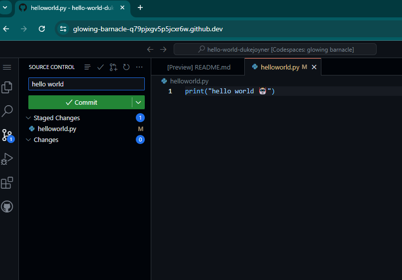
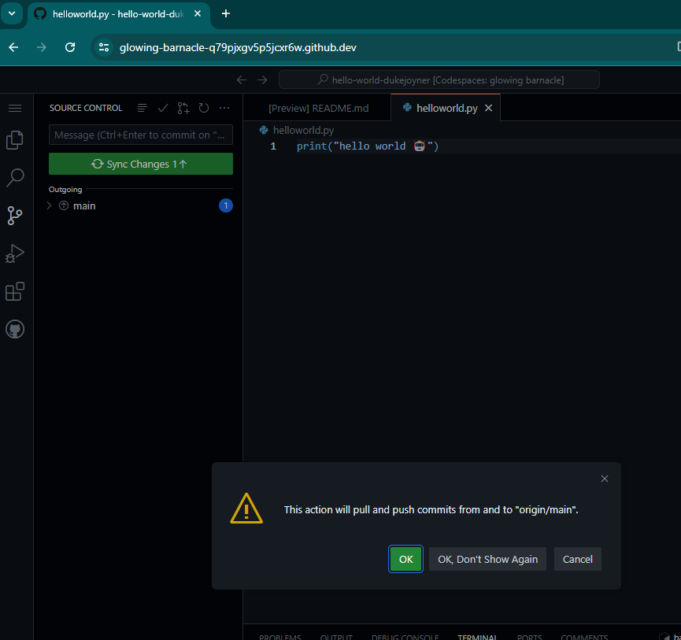
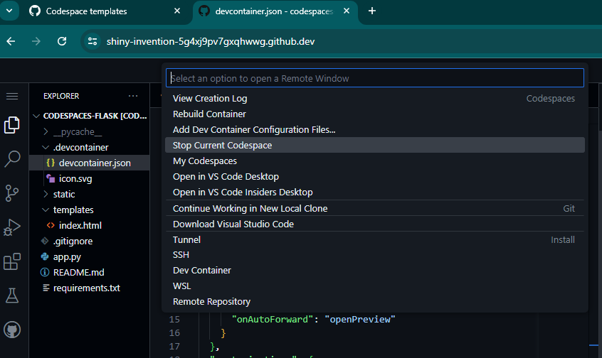

# Getting Started with this course <!-- {docsify-ignore-all} -->

👋 We are very excited for you to start this course and see what you get inspired to build with python and AI!

To ensure your success, this page outlines setup steps, technical requirements, and where to get help if needed.

# Setup Steps
To start taking this course, you will need to complete the following steps.

## 1. Accessing In-Class Code Repos and Homework Assignments (e.g., Lesson 1 - Hello World web app in Streamlit)

You will be given a link in class to access the code repositories and homework assignments. For example, Lesson 1 will guide you through creating a "Hello World" web app in Streamlit.

## 2. Create a codespace

To avoid any dependency issues when running the code, we recommend running this course in a [GitHub Codespaces](https://github.com/features/codespaces).

This can be created by selecting the `Code` option on your forked version of this repo and selecting the Codespaces option

## 3. Stop or Delete Your Codespace  
   
When you are done, remember to stop your codespace on GitHub to avoid any undesired use of your capacity.  
   
<!-- tabs:start -->  

#### **1. Go to Codespaces**

Go to [github.com/codespaces](https://github.com/codespaces). At the bottom of the page, all your codespaces are listed. Click the overflow menu icon (`⋮`) for your codespace.  
   

   
#### **2. Stop Codespace**

Click `Stop codespace` if you'd like to return to your work later.  
   

   
#### **3. Delete Codespace**

Otherwise, click `Delete.`
   

<!-- tabs:end -->

## 4. Submitting your homework assignment (how to commit and push changes)

When you are done with your work, you can submit it by committing the change and then syncing or pushing the changes to the github repository. 

<!-- tabs:start -->

#### **1. Stage and Commit**

Use the Source Control tab in VS Code to stage and commit your changes.

#### **2. Push Changes**

Push (sync) your changes to the repository to submit homework.

#### **3. Sync Changes**

Stop Codespace when finished.

<!-- tabs:end -->

## (Optional) Coding Locally with Visual Studio Code with the Python support extension
If wanting to code locally we recommend using the [Visual Studio Code (VS Code)](https://code.visualstudio.com/) editor with the Python support extension installed for this course. This is, however, more of a recommendation and not a definite requirement because for this coding program you have access to GitHub Codespaces *(just make sure to turn off the codespace when you done)*

## 📚  Resources 
* [A short video explaining what GitHub is](https://www.youtube.com/watch?v=w3jLJU7DT5E&feature=youtu.be) 
* [How to use GitHub branches](https://www.youtube.com/watch?v=H5GJfcp3p4Q&feature=youtu.be)
* [Interactive Git training materials](https://githubtraining.github.io/training-manual/#/01_getting_ready_for_class)

